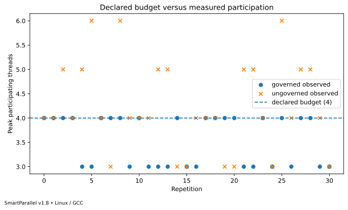
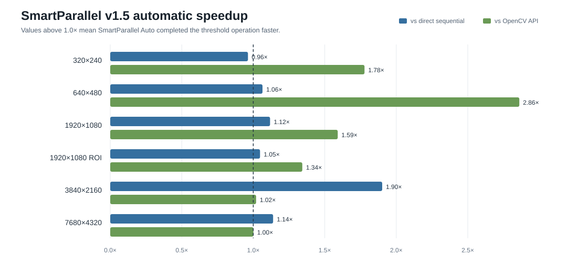

# SmartParallel

## SmartParallel v1.8.0 — Governed Scientific Execution

> **Trust the deployment.**

SmartParallel v1.8 coordinates participating CPU execution paths inside one process under an explicit CPU budget. Multiple Runtime instances may share one `ResourceGovernor`; operation-scoped leases prevent nested reacquisition and deterministic execution rejects unavailable exact grants before output modification. oneTBB is bounded honestly through task arenas, OpenCV is contained through serialized single-thread provider calls, and every resource decision is inspectable.

```cpp
smart::ResourceGovernorOptions governor_options;
governor_options.cpu_budget = 8;
auto governor =
    std::make_shared<smart::ResourceGovernor>(governor_options);

smart::RuntimeOptions options_a;
options_a.governor = governor;
options_a.maximum_workers = 6;
smart::Runtime runtime_a(options_a);

smart::RuntimeOptions options_b;
options_b.governor = governor;
options_b.maximum_workers = 4;
smart::Runtime runtime_b(options_b);
```



See the [v1.8 documentation](docs/v1.8/README.md), [trust contract](docs/v1.8/trust-the-deployment.md), [admission model](docs/v1.8/admission-policies.md), and [benchmark evidence](docs/v1.8/accepted-benchmark-evidence.md).


SmartParallel is a C++17 adaptive CPU execution framework for reproducible scientific and engineering computation. It coordinates parallel scheduling, supports complete semantic-operation routes, and now exposes owned reproducible Runtime state, persistent exact execution profiles, explicit numerical behavior, and non-owning multidimensional data views.

## What it solves

The fastest way to execute a loop depends on callback cost, iteration count, irregularity, backend overhead, and whether the loop is already inside parallel work. Hard-coding one strategy everywhere can make small loops slower and nested loops unsafe or wasteful.

SmartParallel provides an adaptive loop runtime, coordinated nested execution, cross-platform validation, a v1.4 parallel-algorithm layer, and an optional v1.5 semantic-operation layer that can choose between Native SmartParallel and specialized implementations. The stabilized runtime continues to run across Windows, Linux, and macOS:

- **SmartParallel v1.0 — Automatic Loop Optimization:** selects a sequential or parallel execution strategy and improves repeated decisions using runtime observations.
- **SmartParallel v1.1 — Nested Parallelism Coordination:** coordinates nested loops through a shared root session, bounded worker leases, automatic frontier selection, and stable-plan reuse.
- **SmartParallel v1.3 — Cross-Platform CI and Portability:** validates the same scheduler and API on Windows/MSVC, Linux/GCC and Clang, and macOS/Apple Clang, including installed-package consumers and oneTBB on/off builds.
- **SmartParallel v1.4 — Parallel Algorithm Expansion:** adds adaptive elementwise, reduction, counting, predicate, and search algorithms, including pre-scheduler hot dispatch for cheap operations.
- **SmartParallel v1.5 — Adaptive Execution Routes:** adds optional semantic operations whose automatic mode can learn between complete Native routes and specialized providers, beginning with exact 8-bit thresholding and OpenCV.
- **SmartParallel v1.6 — Scientific Foundations:** adds explicit Fast, Reproducible, and Accurate numerical contracts, canonical deterministic reductions, host-memory scientific views, AXPY/dot/norm/stencil operations, and a heat-diffusion pilot.
- **SmartParallel v1.7 — Reproducible Runtime:** adds isolated owned Runtime configuration, lightweight contexts, persistent Candidate/Approved semantic profiles, Adaptive warm starts, exact no-learning Deterministic replay, execution fingerprints, calibration/profile tools, and cross-process heat-diffusion manifests.
- **SmartParallel v1.8 — Governed Scientific Execution:** adds operation-specific CPU admission, hierarchical leases, shared multi-Runtime and nested coordination, exact deterministic grants, direct cancellation, fairness protection, effective-capacity diagnostics, and explainable resource evidence.

## v1.7 — Trust the experiment

```cpp
smart::RuntimeOptions options;
options.worker_budget = 8;
options.execution_mode = smart::ExecutionMode::Adaptive;
smart::Runtime runtime(options);
auto context = runtime.context();
smart::parallel_for(context, 0u, count, callback);
```

Calibrate named semantic operations into Candidate profiles, approve them explicitly, and replay exact Approved plans through a Deterministic ReadOnly Runtime. See [`docs/v1.7/`](docs/v1.7/README.md).

## v1.7 release evidence

The final Windows/MSVC publication passed the complete nine-stage release workflow: **24/24** main tests, **24/24** native-only tests, **3/3** oneTBB + OpenCV tests, **6/6** exact-source-ZIP tests, installed core/profile/Vision/OpenCV consumers, installed calibration and two-process replay, documentation validation, all v1.7 benchmark objectives, and every retained v1.6 numerical and performance-sanity gate.

Adaptive restart warm start measured **2.600×** faster than a fresh cold Adaptive Runtime, with a 95% interval of **2.500–2.764×**. Deterministic Approved replay measured **1.014×** warm latency, with a **0.959–1.084×** interval.


Two fresh replay processes produced byte-identical manifests, identical output digests, nine deterministic replays, and zero learning, timing, holdout, drift, route-switch, or profile-mutation activity.


Performance measurements are machine-specific. See the [complete v1.7 benchmark report](docs/v1.7/benchmarks.md), [methodology](docs/v1.7/benchmark-methodology.md), [validation matrix](docs/v1.7/validation.md), and [release reproduction guide](docs/v1.7/reproduction-guide.md).

## Minimal example

```cpp
#include <smart/execution/parallel.hpp>

#include <cstddef>
#include <vector>

int main()
{
    std::vector<double> values(1'000'000);

    smart::parallel_for(
        std::size_t{0},
        values.size(),
        [&](std::size_t i)
        {
            values[i] = static_cast<double>(i) * 2.0;
        });
}
```

Nested calls use the same API. SmartParallel coordinates them under the active root budget instead of creating independent teams at every depth.

The v1.4 algorithms are available from:

```cpp
#include <smart/execution/algorithms.hpp>

#include <functional>

auto total = smart::parallel_transform_reduce(
    values.begin(), values.end(), 0.0, std::plus<>{},
    [](double value) { return value * value; });
```

v1.6 numerical behavior is selected explicitly per operation:

```cpp
#include <smart/execution/algorithms.hpp>
#include <smart/linalg/linalg.hpp>

const auto reproducible_sum = smart::parallel_reduce(
    values.begin(), values.end(), 0.0,
    smart::NumericalOptions{smart::NumericalPolicy::Reproducible});

auto view = smart::data::VectorView<const double>::contiguous(
    values.data(), {values.size()});
const auto accurate_norm = smart::linalg::norm(
    view, smart::NumericalOptions{smart::NumericalPolicy::Accurate});
```

The optional v1.5 vision module expresses an operation while leaving the complete route automatic:

```cpp
#include <smart/vision/vision.hpp>

smart::vision::threshold(source, destination);
```

Depending on measured behavior and availability, the same call can use Native Sequential, Native ThreadPool, Native oneTBB, or OpenCV `cv::threshold`.

## Capabilities

- Runtime selection between sequential, ThreadPool, StaticThread, and oneTBB execution.
- Automatic profiling, bounded in-process experience, stable-plan reuse, and periodic production revalidation.
- Root-scoped nested concurrency budgets and lease accounting.
- Automatic nested-frontier selection with descendant sequential fast paths.
- Cooperative ThreadPool helping and constrained oneTBB arenas.
- Exception propagation, cooperative cancellation, exactly-once validation, and structured trace export.
- Native Windows, Linux, and macOS CPU-topology/cache discovery with conservative fallbacks.
- Fourteen adaptive v1.4 algorithms covering transforms, reductions, counting, predicates, and search, with a direct one-pass path when automatic scheduling selects sequential execution.
- Optional v1.5 semantic threshold operation with balanced successive-elimination learning, independent holdout verification, sparse drift sentinels, current-context ABBA revalidation, hot-cache reuse, runtime-selected AVX2/SSE2 native kernels, exact strided/in-place support, and optional zero-copy OpenCV execution.
- v1.6 per-operation numerical presets with fixed canonical reduction plans, separate fixed pointwise plans, compensated sum/dot, scaled norm, and authenticated numerical execution reports.
- Experimental host-only `View<T, Rank>`, vector/matrix aliases, element strides, conservative overlap detection, and validated pointer/stride kernels for AXPY, dot, norm, five-point stencil, and heat-diffusion integration.
- v1.7 owned Runtime configuration, copyable contexts, exact persistent profiles, explicit approval, fail-closed Deterministic replay, stable fingerprints, and installed calibration/profile/replay tools.
- Core CMake package installation as `SmartParallel::smart_parallel`, plus the optional separate `SmartParallel::vision` target.

## v1.6 scientific-foundation evidence

The corrected accepted Linux/GCC/x86-64 schema-v2 publication contains **2,442 raw samples**. It evaluates sum, dot, norm, AXPY, five-point stencil, and heat diffusion under Fast, Reproducible, and Accurate policies.

- every execution-validity, required-reference, reproducibility, route-authentication, and numerical-capability gate passed;
- full AXPY vectors, stencil fields, and heat-diffusion fields were validated outside timed regions and recorded with complete-output digests;
- Accurate reduced the fixed adversarial sum and dot absolute errors from **3000 to 0**;
- sum, AXPY, and stencil cross-scheduler matrices passed across their eligible worker budgets and scheduler engines;
- Reproducible and Accurate AXPY/stencil authenticated the new fixed pointwise plans and real parallel execution;
- policy-aware Fast / retained Fast had a paired median of **1.0634×** with a 90% robust interval of **0.9739–1.1611×**; the result is an **not-established**, not evidence of a regression above the 5% investigation boundary;
- the largest Fast AXPY, dot, norm, stencil, and heat workloads all passed the new performance-sanity gate, recording **1.19×**, **2.35×**, **2.96×**, **3.78×**, and **2.14×** speedups over their compact direct-sequential references on the accepted machine;
- the complete corrected deterministic suite passed **20/20** tests;
- nine restrained SVG plots, raw data, generated statistics, environment metadata, and source hashes are retained under `docs/v1.6/assets/benchmarks/`.


The accepted heat-diffusion run validates the complete field and records machine-specific ThreadPool speedups of **2.14× Fast**, **1.98× Reproducible**, and **2.10× Accurate** over the compact direct-sequential oracle on an AMD EPYC 9V74 environment. These values demonstrate the corrected validated pointer/stride kernel on that machine; they are not universal speed guarantees.

The final v1.7 Windows/MSVC release workflow reran the corrected v1.6 suite after the validated pointer/stride kernels: **3,936 samples**, all numerical and reproducibility gates passed, and the largest Fast AXPY, dot, norm, stencil, and heat workloads measured **1.585×**, **1.196×**, **2.572×**, **1.436×**, and **1.943×** over compact direct-sequential references. The retained paired Fast ratio was **0.9766× [0.9096, 1.0486]** and passed. See the [Windows v1.6 regression evidence](docs/v1.7/assets/benchmarks/windows-msvc-20260801/v1.6-regression/). Earlier Windows sets remain historical traceability only.

These measurements are machine-specific. The reproducibility guarantee is limited to the same binary, architecture, floating-point environment, input representation, policy, plan version, and documented compiler configuration. See the [v1.6 overview](docs/v1.6/README.md), [complete benchmark report](docs/v1.6/benchmarks.md), [numerical contract](docs/v1.6/numerical-contract.md), and [reproduction guide](docs/v1.6/benchmark-reproduction.md).

## v1.5 adaptive-route results

The accepted Windows/MSVC Release publication run evaluated exact `uint8_t` thresholding across six image profiles from 320×240 through 8K, including a strided 1080p ROI:

- all **2,238 measured samples** passed exact-output correctness and route authentication;
- all **6/6 combined release gates** passed;
- Auto achieved a **1.16× geometric-mean speedup over the independent sequential loop** and **1.48× over direct OpenCV** on the recorded machine;
- Auto settled on Native Sequential for the small and 1080p profiles and Native ThreadPool for 4K and 8K;
- the two 1080p profiles initially learned OpenCV, detected a changed deployment regime, and switched once to Native Sequential;
- the authenticated Native AVX2 kernel passed the independent compiler-oracle gate on all six presets;
- stable Auto dispatch was approximately **0.012–0.051 µs** for the small and medium profiles, while large-profile intervals were correctly reported as statistically inconclusive passes.



These measurements are machine-specific. The release claim is that Auto selected a route within the declared equivalence gate and adapted when its original decision became stale—not that one provider is universally fastest. See the [complete v1.5 benchmark report](docs/v1.5/benchmarks.md), [methodology](docs/v1.5/benchmark-methodology.md), and [reproduction guide](docs/v1.5/benchmark-reproduction.md).

## v1.4 algorithm results

The accepted Windows/MSVC Release snapshot covers sixteen algorithm cases across sequential, automatic, ThreadPool, StaticThread, and oneTBB modes:

- all **80 summary rows** and **560 raw samples** passed correctness and backend authentication;
- automatic selected ThreadPool for eight compute-heavy cases and direct sequential execution for eight cheap or bandwidth-sensitive cases;
- the parallel-selected group achieved a **3.30× geometric-mean speedup**, ranging from **2.67× to 3.53×**;
- every corrected cheap-dispatch family stayed within **3.5%** of direct sequential latency or faster.


The results are machine-specific. See the [complete v1.4 benchmark report](docs/v1.4/benchmarks.md), [methodology](docs/v1.4/benchmark-methodology.md), and [reproduction guide](docs/v1.4/benchmark-reproduction.md).

## Real-world v1.1 results

The final recorded suite covers OpenCV image pipelines, LZ4 batch compression, custom BVH construction, and a custom particle simulation. On the recorded four-worker Windows/MSVC machine:

- all **20 meaningful presets** (automatic median runtime at least 1 ms) beat sequential execution;
- automatic execution achieved a **2.33× geometric-mean speedup** across those presets;
- **19 of 20** were within 20% of the fastest valid tested strategy;
- all reported rows passed correctness checks, backend traces authenticated execution, and root concurrency stayed within four participants.

The results are machine-specific measurements, not universal guarantees. See the [v1.1 benchmark report](docs/v1.1/benchmarks.md) and [methodology](docs/v1.1/benchmark-methodology.md).

## Build

Requirements: CMake 3.20+, a C++17 compiler, and oneTBB only when the oneTBB backend is enabled. OpenCV is required only when the optional v1.5 OpenCV route is enabled. The v1.6 scientific foundation has no external numerical-library dependency. SmartParallel is continuously validated with MSVC, GCC, Clang, and Apple Clang. The repository includes a vcpkg manifest for oneTBB and optional real-world benchmark dependencies.

```text
cmake --preset release
cmake --build --preset release
```

Install and consume the exported package:

```text
cmake --install build/release --prefix path/to/install
```

```cmake
find_package(SmartParallel CONFIG REQUIRED)
target_link_libraries(my_application PRIVATE SmartParallel::smart_parallel)
```

When the optional vision module was installed:

```cmake
find_package(SmartParallelVision CONFIG REQUIRED)
target_link_libraries(my_application PRIVATE SmartParallel::vision)
```

Windows users can build, test, and benchmark every v1.4 algorithm with:

```bat
set "VCPKG_ROOT=D:\Tools\vcpkg" && scripts\validation\run_v14_algorithm_release_validation.bat 7
```

Run the v1.7 Reproducible Runtime publication workflow with:

```bat
scripts\validation\run_v17_reproducible_runtime_release_validation.bat 31 full
```

or on Linux/macOS:

```sh
SMARTPARALLEL_BUILD_JOBS=2 sh scripts/validation/run_v17_reproducible_runtime_release_validation.sh 11 full
```

Use `smoke` instead of `full` to skip the extended compiler matrices while retaining the complete regression, benchmarks, installed consumers, CLI replay pilot, source ZIP creation, and exact-ZIP rebuild.

The retained v1.6 scientific-foundation workflow remains available through the corresponding `run_v16_...` script.

Run the v1.5 adaptive-route publication workflow with:

```bat
set "VCPKG_ROOT=D:\Tools\vcpkg" && scripts\validation\run_v15_adaptive_routes_release_validation.bat 31
```

The publication workflow first learns under repeated calls, then enters a balanced interleaved deployment regime with normal drift detection and current-context revalidation enabled. After the route settles, maintenance is paused only for the clean timed matrix. The workflow records training and current baselines, route switches, drift evidence, balanced route orders, and batched adjacent ABBA/BAAB dispatch overhead. Production drift detection and revalidation remain enabled outside that measurement window.

The historical v1.1 real-world suite remains available through `scripts\benchmarks\run_real_world_complete.bat`. See the [v1.4 API](docs/v1.4/api.md), [architecture](docs/v1.4/architecture.md), [benchmark results](docs/v1.4/benchmarks.md), [v1.4 reproduction guide](docs/v1.4/benchmark-reproduction.md), [v1.3 cross-platform installation guide](docs/v1.3/installation.md), [GitHub Actions setup](docs/v1.3/ci-and-github-setup.md), [native hardware discovery](docs/v1.3/native-hardware-discovery.md), and [release checklist](docs/v1.3/release-checklist.md).

## Documentation

- [v1.8 documentation](docs/v1.8/README.md) — process-level CPU governance, exact resource admission, benchmarks, and validation
- [v1.8 accepted benchmark evidence](docs/v1.8/accepted-benchmark-evidence.md) — Linux/GCC raw data, 95% intervals, and publication figures
- [v1.8 release validation status](docs/v1.8/validation-status.md) — accepted Linux evidence and the remaining Windows acceptance step
- [v1.7 documentation](docs/v1.7/README.md) — owned Runtime state, persistent profiles, deterministic replay, tools, fingerprints, and release validation
- [v1.7 reproduction guide](docs/v1.7/reproduction-guide.md) — benchmarks, CLI pilot, package consumers, and exact-ZIP validation
- [v1.6 documentation](docs/v1.6/README.md) — numerical contracts, data views, scientific operations, pilot, and evidence
- [v1.6 numerical contract](docs/v1.6/numerical-contract.md) — exact policy and reproducibility scope
- [v1.6 benchmark reproduction](docs/v1.6/benchmark-reproduction.md) — release workflow and outputs
- [v1.5 documentation](docs/v1.5/README.md) — adaptive execution routes and optional OpenCV provider
- [v1.5 benchmark results](docs/v1.5/benchmarks.md) — accepted 6/6 proof-gate publication and figures
- [v1.5 benchmark methodology](docs/v1.5/benchmark-methodology.md) — fairness, learning, adaptation, and release gates
- [v1.4 documentation](docs/v1.4/README.md) — parallel-algorithm release retained by v1.5
- [v1.4 benchmark results](docs/v1.4/benchmarks.md) — accepted automatic/forced backend matrix and graphs
- [v1.3 documentation](docs/v1.3/README.md) — portability and CI release
- [v1.1 runtime documentation](docs/v1.1/README.md) — scheduler and nested-parallelism behavior retained by v1.4
- [Getting started](docs/v1.1/getting-started.md)
- [API reference](docs/v1.1/api.md)
- [Architecture](docs/v1.1/architecture.md)
- [Nested parallelism](docs/v1.1/nested-parallelism.md)
- [Runtime learning](docs/v1.1/runtime-learning.md)
- [Diagnostics](docs/v1.1/diagnostics.md)
- [Known limitations](docs/v1.1/known-limitations.md)
- [v1.0 archive](docs/v1.0/README.md)
- [Historical engineering archive](docs/archive/README.md)

## Project status

**Current release candidate: v1.8.0 — Governed Scientific Execution.** v1.8 preserves the validated v1.0–v1.7 APIs, numerical contracts, profiles, and deterministic replay while adding operation-specific CPU admission, shared multi-Runtime budgets, hierarchical nested leases, direct cancellation wakeups, starvation-resistant admission, and explainable resource evidence. The accepted Linux/GCC publication and exact-archive validation are retained in this source tree. Final Windows/MSVC publication evidence remains a separate required acceptance step before the release is tagged final.

Important boundaries remain: governance covers participating execution paths inside one process, not unrelated application threads or external processes; oneTBB limits are upper bounds rather than private worker ownership; direct OpenCV use outside SmartParallel is not governed; deterministic execution does not promise identical queue timing; cross-architecture bitwise identity is not promised; and automatic scheduling is not guaranteed to beat the best manually selected strategy on every workload.

## License

SmartParallel is distributed under the terms in [LICENSE](LICENSE).
