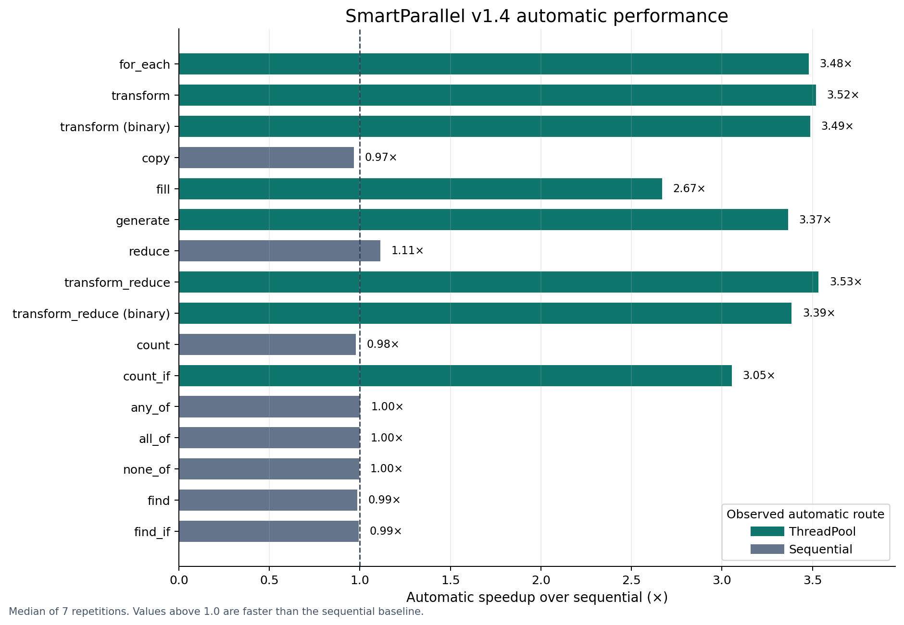

# SmartParallel

SmartParallel is a C++17 library that chooses and coordinates CPU parallel-loop execution at runtime, including nested loops that would otherwise oversubscribe the machine.

## What it solves

The fastest way to execute a loop depends on callback cost, iteration count, irregularity, backend overhead, and whether the loop is already inside parallel work. Hard-coding one strategy everywhere can make small loops slower and nested loops unsafe or wasteful.

SmartParallel provides an adaptive loop runtime, coordinated nested execution, cross-platform validation, and a v1.4 parallel-algorithm layer. The stabilized runtime continues to run across Windows, Linux, and macOS:

- **SmartParallel v1.0 — Automatic Loop Optimization:** selects a sequential or parallel execution strategy and improves repeated decisions using runtime observations.
- **SmartParallel v1.1 — Nested Parallelism Coordination:** coordinates nested loops through a shared root session, bounded worker leases, automatic frontier selection, and stable-plan reuse.
- **SmartParallel v1.3 — Cross-Platform CI and Portability:** validates the same scheduler and API on Windows/MSVC, Linux/GCC and Clang, and macOS/Apple Clang, including installed-package consumers and oneTBB on/off builds.
- **SmartParallel v1.4 — Parallel Algorithm Expansion:** adds adaptive elementwise, reduction, counting, predicate, and search algorithms, including pre-scheduler hot dispatch for cheap operations.

## Minimal example

```cpp
#include <smart/execution/parallel.hpp>

#include <cstddef>
#include <vector>

int main()
{
    std::vector<double> values(1'000'000);

    smart::parallel_for(
        std::size_t{0},
        values.size(),
        [&](std::size_t i)
        {
            values[i] = static_cast<double>(i) * 2.0;
        });
}
```

Nested calls use the same API. SmartParallel coordinates them under the active root budget instead of creating independent teams at every depth.

The v1.4 algorithms are available from:

```cpp
#include <smart/execution/algorithms.hpp>

#include <functional>

auto total = smart::parallel_transform_reduce(
    values.begin(), values.end(), 0.0, std::plus<>{},
    [](double value) { return value * value; });
```

## Capabilities

- Runtime selection between sequential, ThreadPool, StaticThread, and oneTBB execution.
- Automatic profiling, bounded in-process experience, stable-plan reuse, and periodic production revalidation.
- Root-scoped nested concurrency budgets and lease accounting.
- Automatic nested-frontier selection with descendant sequential fast paths.
- Cooperative ThreadPool helping and constrained oneTBB arenas.
- Exception propagation, cooperative cancellation, exactly-once validation, and structured trace export.
- Native Windows, Linux, and macOS CPU-topology/cache discovery with conservative fallbacks.
- Fourteen adaptive v1.4 algorithms covering transforms, reductions, counting, predicates, and search, with a direct one-pass path when automatic scheduling selects sequential execution.
- CMake package installation as `SmartParallel::smart_parallel`.

## v1.4 algorithm results

The accepted Windows/MSVC Release snapshot covers sixteen algorithm cases across sequential, automatic, ThreadPool, StaticThread, and oneTBB modes:

- all **80 summary rows** and **560 raw samples** passed correctness and backend authentication;
- automatic selected ThreadPool for eight compute-heavy cases and direct sequential execution for eight cheap or bandwidth-sensitive cases;
- the parallel-selected group achieved a **3.30× geometric-mean speedup**, ranging from **2.67× to 3.53×**;
- every corrected cheap-dispatch family stayed within **3.5%** of direct sequential latency or faster.



The results are machine-specific. See the [complete v1.4 benchmark report](docs/v1.4/benchmarks.md), [methodology](docs/v1.4/benchmark-methodology.md), and [reproduction guide](docs/v1.4/benchmark-reproduction.md).

## Real-world v1.1 results

The final recorded suite covers OpenCV image pipelines, LZ4 batch compression, custom BVH construction, and a custom particle simulation. On the recorded four-worker Windows/MSVC machine:

- all **20 meaningful presets** (automatic median runtime at least 1 ms) beat sequential execution;
- automatic execution achieved a **2.33× geometric-mean speedup** across those presets;
- **19 of 20** were within 20% of the fastest valid tested strategy;
- all reported rows passed correctness checks, backend traces authenticated execution, and root concurrency stayed within four participants.

The results are machine-specific measurements, not universal guarantees. See the [v1.1 benchmark report](docs/v1.1/benchmarks.md) and [methodology](docs/v1.1/benchmark-methodology.md).

## Build

Requirements: CMake 3.20+, a C++17 compiler, and oneTBB only when the oneTBB backend is enabled. SmartParallel v1.4 is continuously validated with MSVC, GCC, Clang, and Apple Clang. The repository includes a vcpkg manifest for oneTBB and optional real-world benchmark dependencies.

```text
cmake --preset release
cmake --build --preset release
```

Install and consume the exported package:

```text
cmake --install build/release --prefix path/to/install
```

```cmake
find_package(SmartParallel CONFIG REQUIRED)
target_link_libraries(my_application PRIVATE SmartParallel::smart_parallel)
```

Windows users can build, test, and benchmark every v1.4 algorithm with:

```bat
set "VCPKG_ROOT=D:\Tools\vcpkg" && scripts\validation\run_v14_algorithm_release_validation.bat 7
```

The historical v1.1 real-world suite remains available through `scripts\benchmarks\run_real_world_complete.bat`. See the [v1.4 API](docs/v1.4/api.md), [architecture](docs/v1.4/architecture.md), [benchmark results](docs/v1.4/benchmarks.md), [v1.4 reproduction guide](docs/v1.4/benchmark-reproduction.md), [v1.3 cross-platform installation guide](docs/v1.3/installation.md), [GitHub Actions setup](docs/v1.3/ci-and-github-setup.md), [native hardware discovery](docs/v1.3/native-hardware-discovery.md), and [release checklist](docs/v1.3/release-checklist.md).

## Documentation

- [v1.4 documentation](docs/v1.4/README.md) — current parallel-algorithm release
- [v1.4 benchmark results](docs/v1.4/benchmarks.md) — accepted automatic/forced backend matrix and graphs
- [v1.3 documentation](docs/v1.3/README.md) — portability and CI release
- [v1.1 runtime documentation](docs/v1.1/README.md) — scheduler and nested-parallelism behavior retained by v1.4
- [Getting started](docs/v1.1/getting-started.md)
- [API reference](docs/v1.1/api.md)
- [Architecture](docs/v1.1/architecture.md)
- [Nested parallelism](docs/v1.1/nested-parallelism.md)
- [Runtime learning](docs/v1.1/runtime-learning.md)
- [Diagnostics](docs/v1.1/diagnostics.md)
- [Known limitations](docs/v1.1/known-limitations.md)
- [v1.0 archive](docs/v1.0/README.md)
- [Historical engineering archive](docs/archive/README.md)

## Project status

**Current release: v1.4.0.** v1.4 keeps the stabilized scheduler and nested runtime while adding adaptive elementwise, reduction, counting, predicate, and search APIs. The repository now includes accepted v1.4 algorithm measurements and the retained v1.1 real-world integration results; performance benchmarks remain manual and machine-specific.

Important boundaries remain: admission is per root rather than process-wide, global configuration must not be mutated concurrently, traces add overhead, experience is in-memory by default, and automatic scheduling is not guaranteed to beat the best manually selected strategy on every workload.

## License

SmartParallel is distributed under the terms in [LICENSE](LICENSE).
