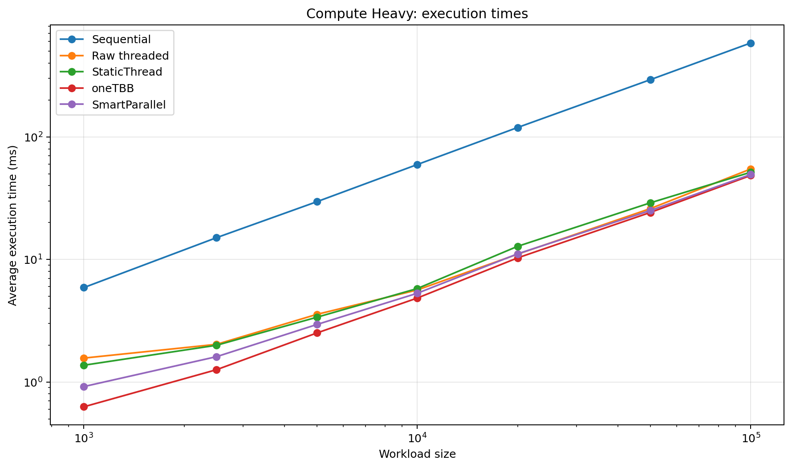
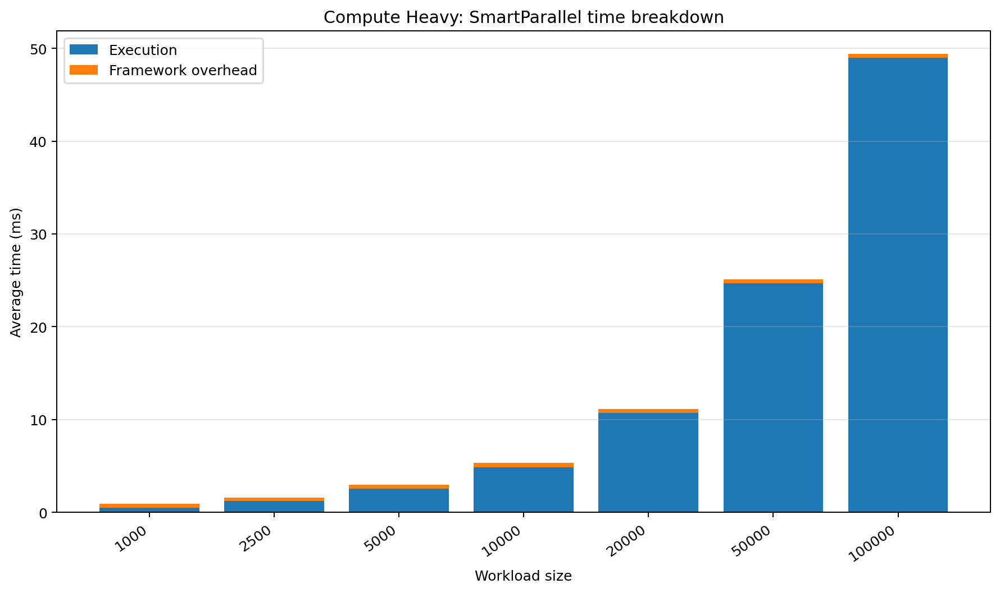
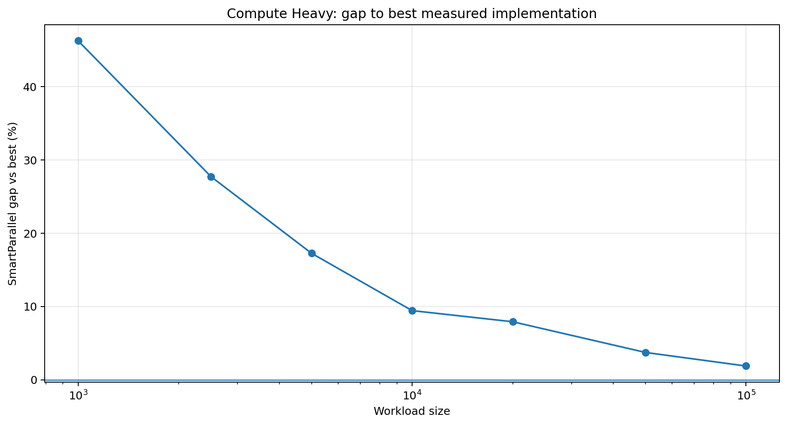
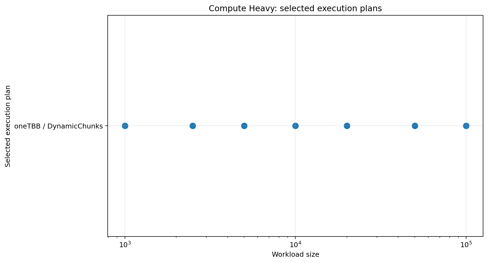

# Compute-Heavy Workload

## Purpose

Tests whether expensive independent iterations are routed to a high-throughput parallel backend.

## Workload

A uniform floating-point kernel with repeated square-root and arithmetic operations.

## Implementations compared

- sequential loop
- raw `std::thread` chunking
- SmartParallel static-thread execution
- direct oneTBB execution
- SmartParallel automatic execution

## Run

From the repository root, compile with the same Release configuration used for the other benchmarks, then run:

```powershell
.\benchmarks\compute_heavy\compute_heavy_benchmark.exe
```

The program writes `output/beta_1_0/results.csv`. Regenerate all figures with:

```powershell
py benchmarks\plot_all.py
```

## Results









## Interpretation

SmartParallel selects oneTBB with dynamic chunks. The fixed profiling cost is most visible at the smallest sizes; the gap narrows as execution time grows.

In the committed Beta 1.0 data, the largest case (`100,000`) reports a SmartParallel gap of **1.87%** and selects **oneTBB / DynamicChunks**.

## Notes

The committed CSV contains 7 benchmark cases from one development machine. Treat the figures as validation data for this version, not as universal performance guarantees.
