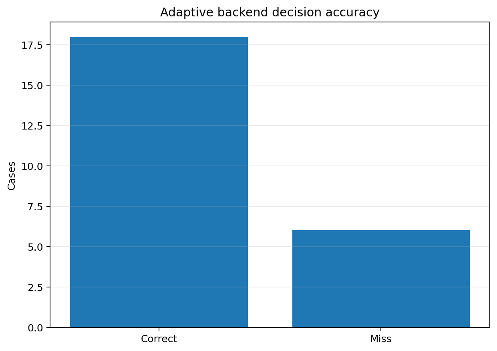
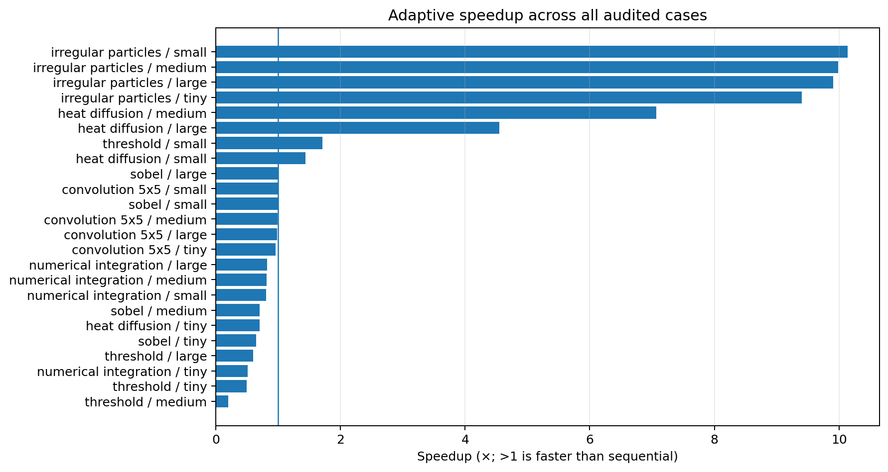
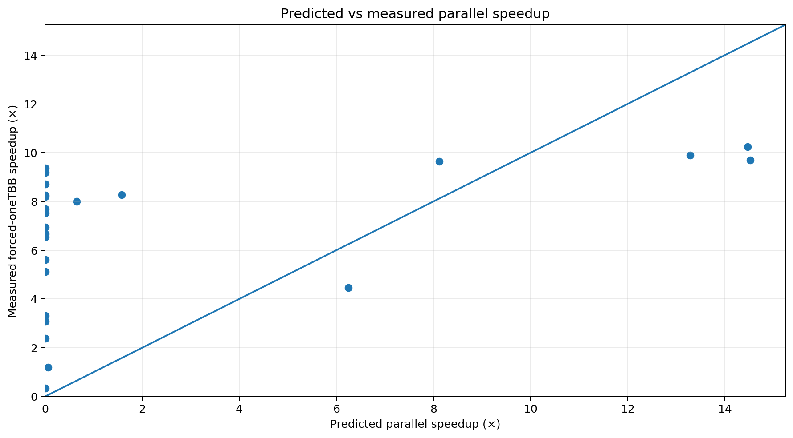
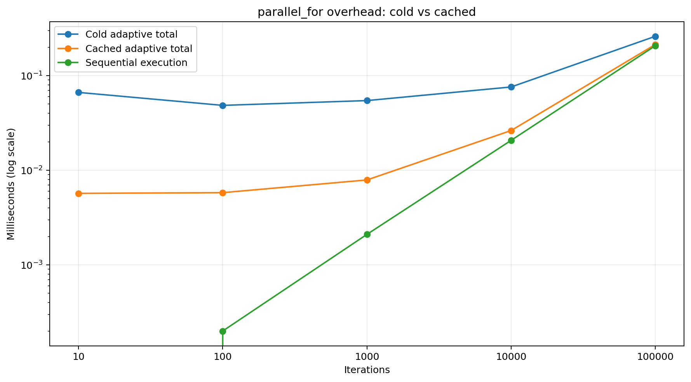
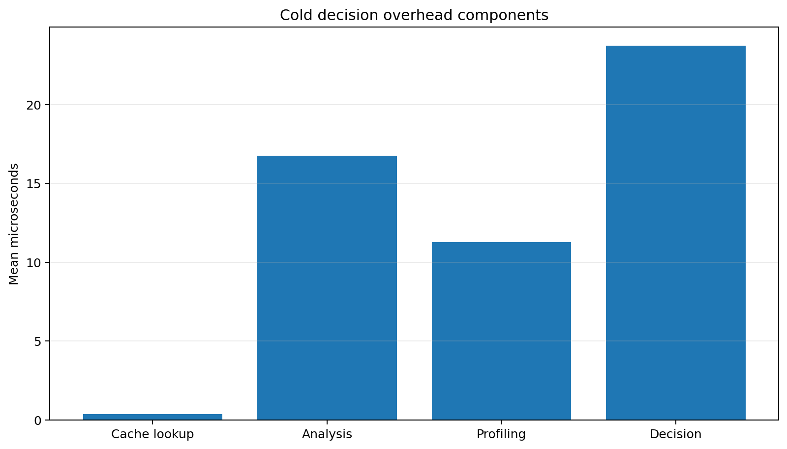

# Decision-quality audit results

The audit compares forced sequential execution, forced oneTBB execution, and SmartParallel's adaptive choice for **24 application cases**. The recorded run reports **16 hardware threads**.

## Headline results

| Metric | Result |
| --- | ---: |
| Backend decisions matching the measured winner | 18/24 (75.0%) |
| Output-correct cases | 24/24 |
| Cases using adaptive oneTBB | 17 |
| Cases using adaptive sequential | 7 |
| Median adaptive speedup vs sequential | 0.99× |
| Geometric-mean adaptive speedup vs sequential | 1.41× |
| Maximum adaptive speedup | 10.14× |
| Mean decision time | 29.4 µs |
| Mean profiling time | 11.9 µs |





A decision is counted as correct when `adaptive_backend` equals the backend with the lowest measured forced runtime. `adaptive_regret` is `adaptive_ms / best_ms`; 1.0 is ideal, while larger values quantify the total cost of the selected path and adaptive machinery relative to the measured best backend.

## Prediction calibration



The scatter plot compares the model's predicted parallel speedup with the measured forced-oneTBB speedup. Large departures from the diagonal indicate calibration opportunities. Prediction quality and end-to-end adaptive runtime are related but distinct: profiling and decision overhead can dominate sub-millisecond kernels even when the backend class is correct.

## Largest recorded misses

| Benchmark | Case | Best | Selected | Sequential ms | oneTBB ms | Adaptive ms | Regret |
| --- | --- | --- | --- | --- | --- | --- | --- |
| numerical_integration | small | oneTBB | Sequential | 1.352 | 0.195 | 1.667 | 8.55× |
| numerical_integration | tiny | oneTBB | Sequential | 0.134 | 0.041 | 0.263 | 6.48× |
| heat_diffusion | small | oneTBB | Sequential | 36.776 | 4.598 | 25.547 | 5.56× |
| convolution_5x5 | tiny | oneTBB | Sequential | 0.216 | 0.042 | 0.225 | 5.32× |
| sobel | tiny | oneTBB | Sequential | 0.099 | 0.032 | 0.152 | 4.72× |
| heat_diffusion | tiny | oneTBB | Sequential | 0.700 | 0.585 | 0.991 | 1.70× |

The audit's 6 misses are concentrated in workloads where small absolute timings magnify scheduler/profiling overhead or where the model selects parallel execution despite an inexpensive sequential kernel. These rows should be treated as optimization targets, not hidden as noise.

## `parallel_for` overhead





| Iterations | Sequential ms | Cold total ms | Cold scheduler ms | Cached total ms | Cached scheduler ms |
| --- | --- | --- | --- | --- | --- |
| 10.000 | 0.000 | 0.067 | 0.058 | 0.006 | 0.006 |
| 100.000 | 0.000 | 0.049 | 0.035 | 0.006 | 0.006 |
| 1000.000 | 0.002 | 0.054 | 0.039 | 0.008 | 0.006 |
| 10000.000 | 0.021 | 0.076 | 0.041 | 0.026 | 0.006 |
| 100000.000 | 0.207 | 0.261 | 0.040 | 0.213 | 0.006 |

The cached path reduces mean scheduler overhead from **42.7 µs** to **5.8 µs**. Cold analysis, profiling, and decision work average **51.8 µs**. Consequently, cache reuse is important for small loops, while the overhead becomes proportionally small once execution reaches hundreds of microseconds or more.

## Run

```bat
benchmarks\decision_quality\scripts\run_decision_quality_audit.bat
```

Output: `validation/output/all_benchmarks_decision_quality.csv`. The documented snapshot is in [`../results/data`](../results/data).
