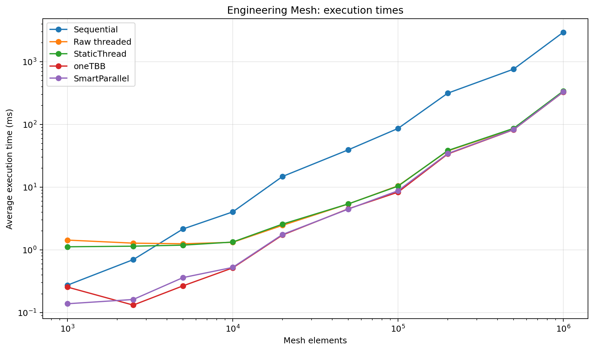
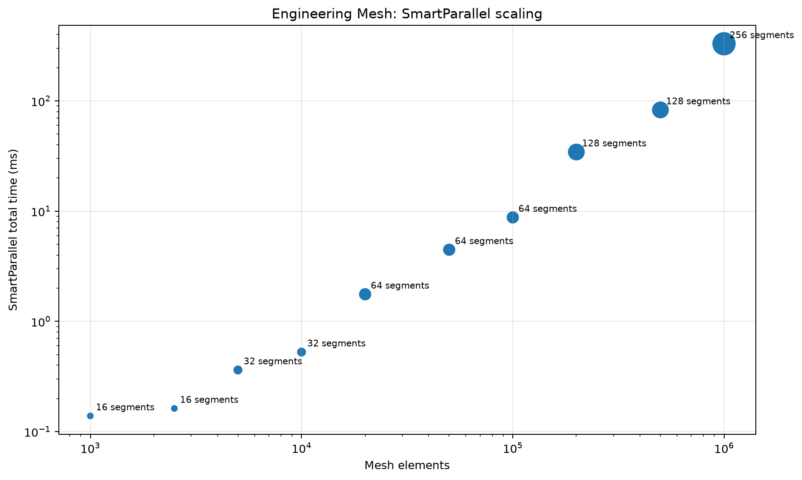
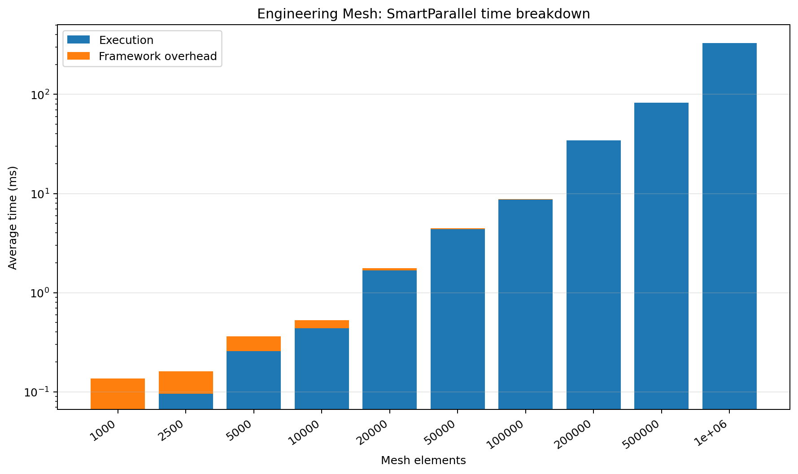
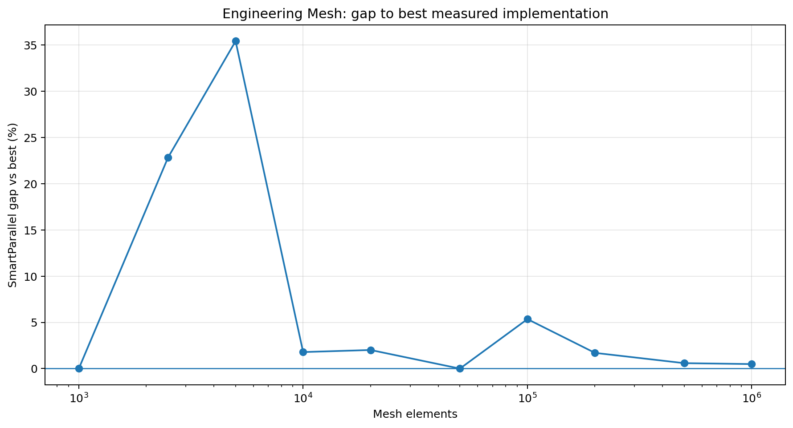
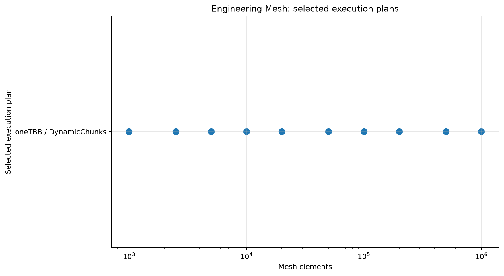

# Engineering Mesh

## Purpose

Provides a more realistic geometry and engineering workload than synthetic scalar kernels.

## Workload

Generates triangle and quad elements, computes barycenters and areas, and tests every element against a set of 3D segments.

## Implementations compared

- sequential loop
- raw `std::thread` chunking
- SmartParallel static-thread execution
- direct oneTBB execution
- SmartParallel automatic execution

## Run

From the repository root, compile with the same Release configuration used for the other benchmarks, then run:

```powershell
.\benchmarks\engineering_mesh\engineering_mesh_benchmark.exe
```

The program writes `output/beta_1_0/results.csv`. Regenerate all figures with:

```powershell
py benchmarks\plot_all.py
```

## Results











## Interpretation

SmartParallel selects oneTBB dynamic execution across the tested cases. At large element counts its total time is typically close to direct oneTBB, while framework overhead remains a small fraction of total time.

In the committed Beta 1.0 data, the largest case (`1,000,000`) reports a SmartParallel gap of **0.49%** and selects **oneTBB / DynamicChunks**.

## Notes

The committed CSV contains 10 benchmark cases from one development machine. Treat the figures as validation data for this version, not as universal performance guarantees.
