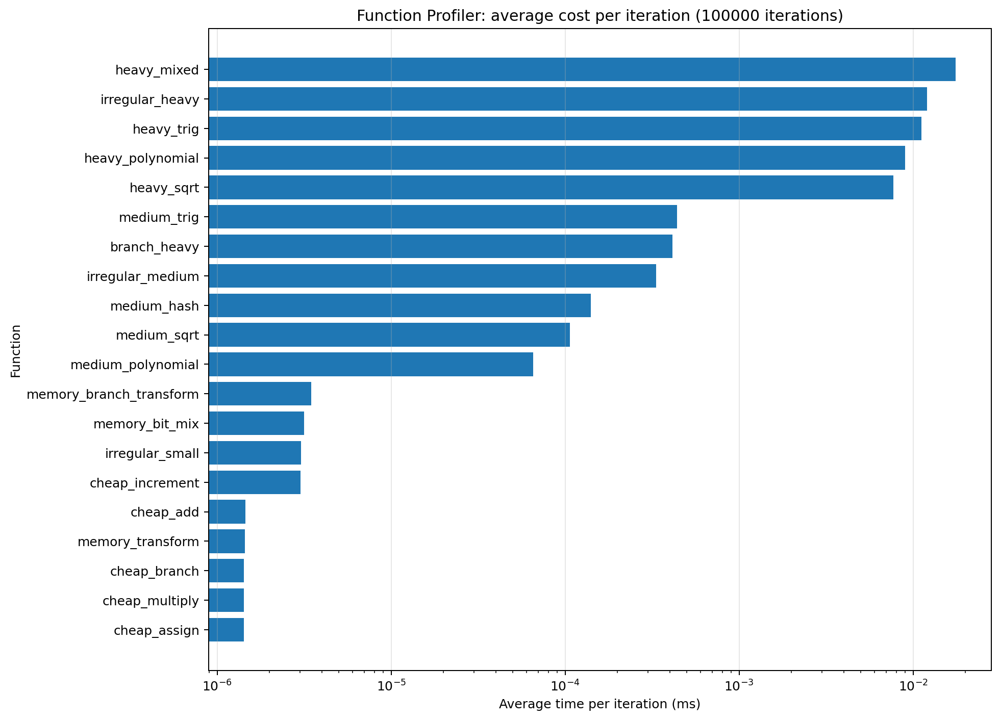
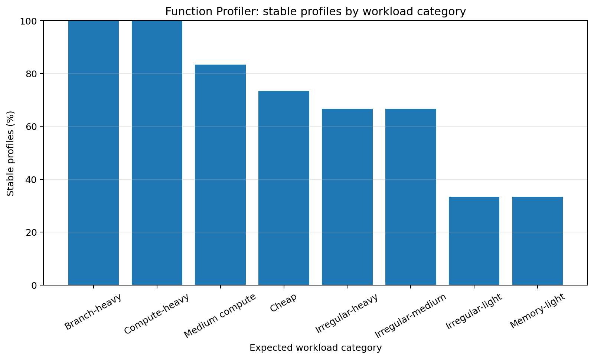
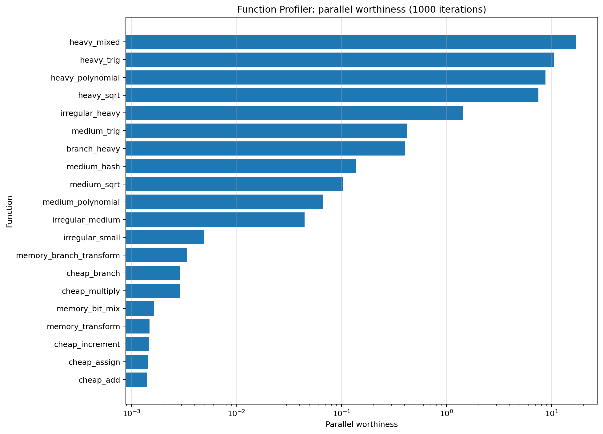
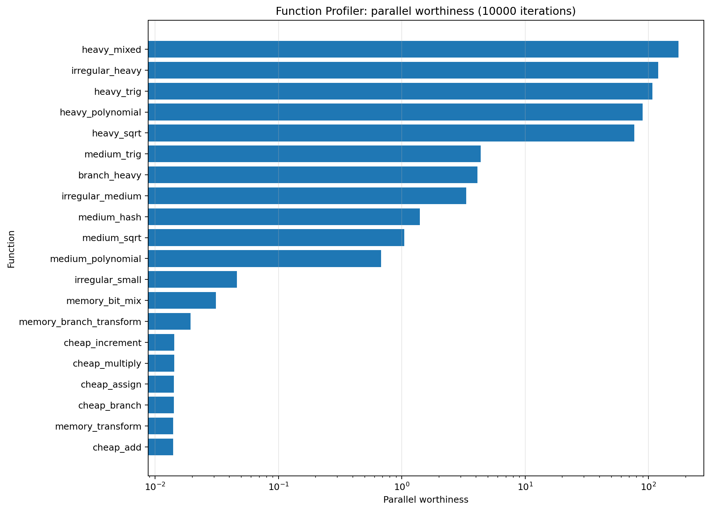
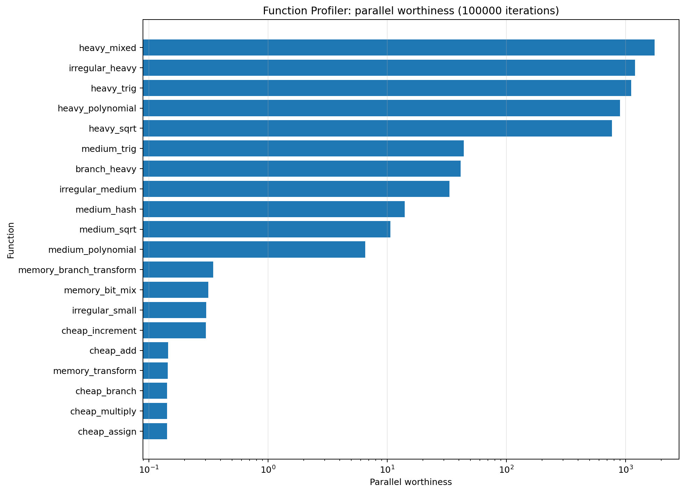

# Function Profiler

## Purpose

Validates cost ranking, estimated total work, parallel worthiness, and stability reporting.

## Workload

Profiles twenty cheap, medium, heavy, branch-heavy, and irregular functions at three dataset sizes.

## Implementations compared

- sequential loop
- raw `std::thread` chunking
- SmartParallel static-thread execution
- direct oneTBB execution
- SmartParallel automatic execution

## Run

From the repository root, compile with the same Release configuration used for the other benchmarks, then run:

```powershell
.\benchmarks\function_profiler\function_profiler_benchmark.exe
```

The program writes `output/beta_1_0/results.csv`. Regenerate all figures with:

```powershell
py benchmarks\plot_all.py
```

## Results











## Interpretation

Compute-heavy functions rank at the top across sizes, cheap operations rank at the bottom, and irregular functions are more likely to be marked unstable at small sample scales.


## Notes

The committed CSV contains 60 benchmark cases from one development machine. Treat the figures as validation data for this version, not as universal performance guarantees.
