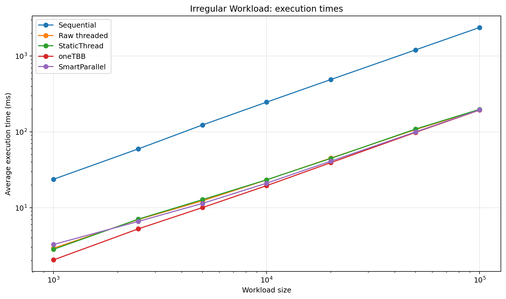
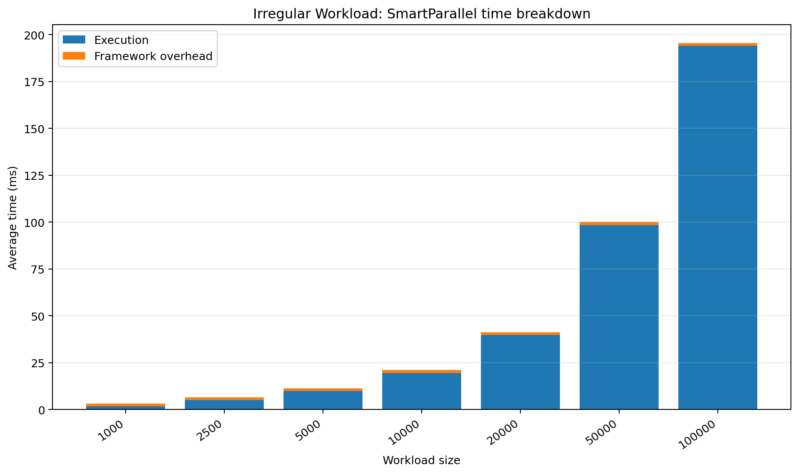
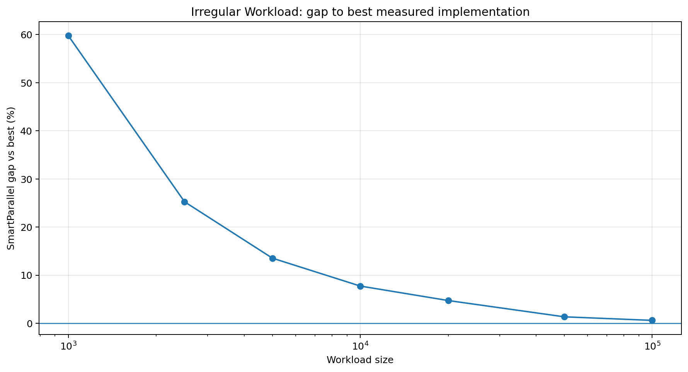
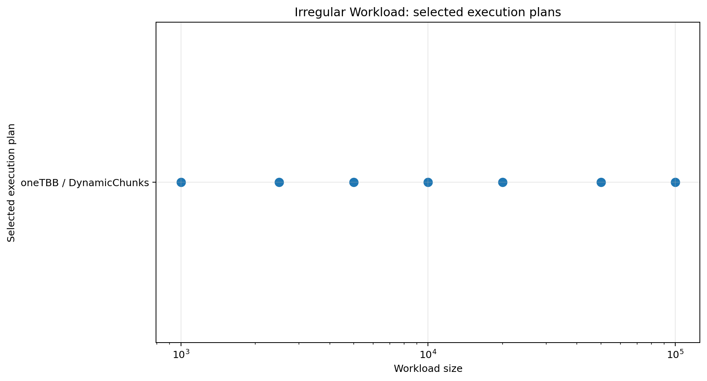

# Irregular Workload

## Purpose

Tests scheduling under strong per-iteration variance.

## Workload

Iteration cost varies from zero to 2047 loops of square-root and trigonometric work.

## Implementations compared

- sequential loop
- raw `std::thread` chunking
- SmartParallel static-thread execution
- direct oneTBB execution
- SmartParallel automatic execution

## Run

From the repository root, compile with the same Release configuration used for the other benchmarks, then run:

```powershell
.\benchmarks\irregular_workload\irregular_workload_benchmark.exe
```

The program writes `output/beta_1_0/results.csv`. Regenerate all figures with:

```powershell
py benchmarks\plot_all.py
```

## Results









## Interpretation

Dynamic oneTBB execution is consistently selected. Profiling overhead is higher than in regular benchmarks because sampled iterations can be expensive and unstable, but the relative gap falls at larger sizes.

In the committed Beta 1.0 data, the largest case (`100,000`) reports a SmartParallel gap of **0.61%** and selects **oneTBB / DynamicChunks**.

## Notes

The committed CSV contains 7 benchmark cases from one development machine. Treat the figures as validation data for this version, not as universal performance guarantees.
