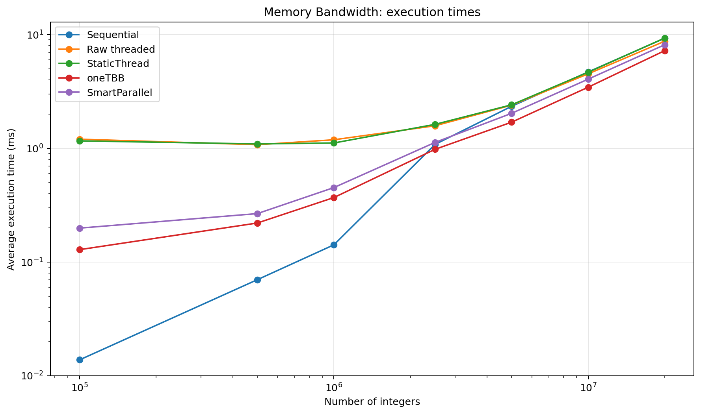
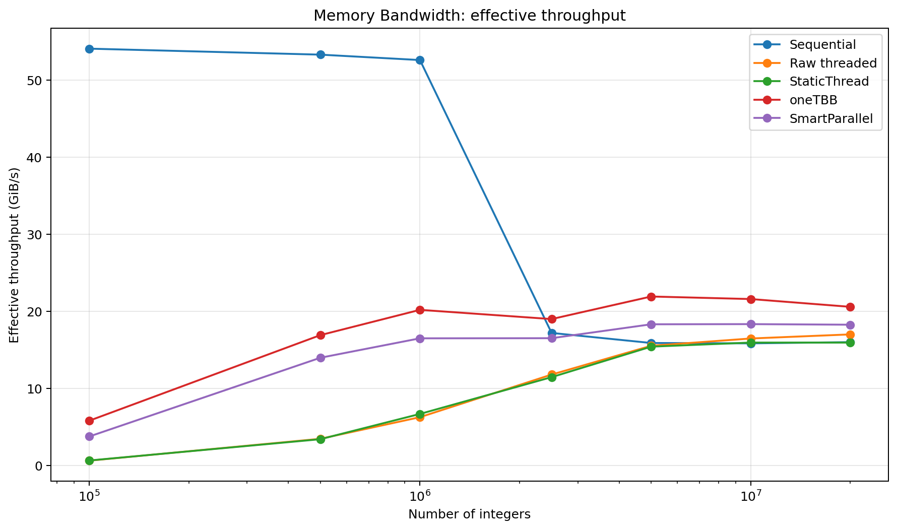
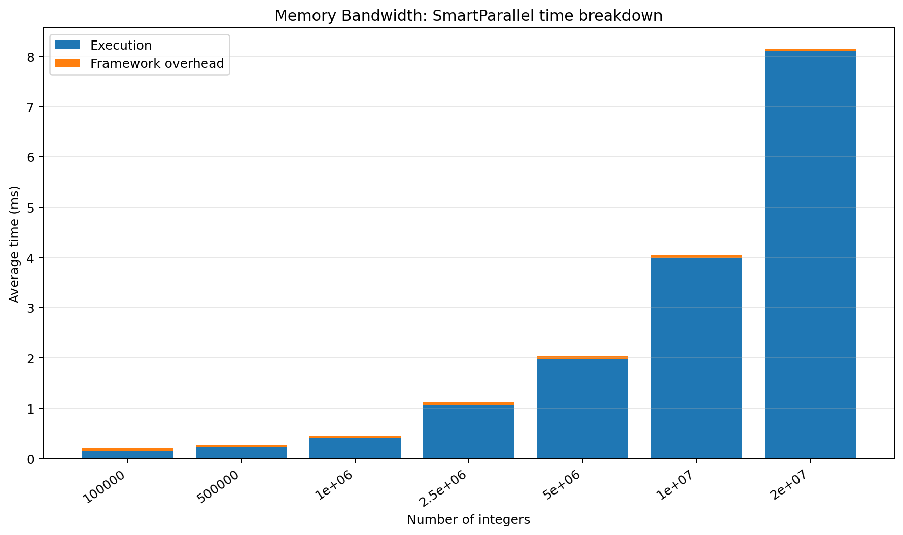
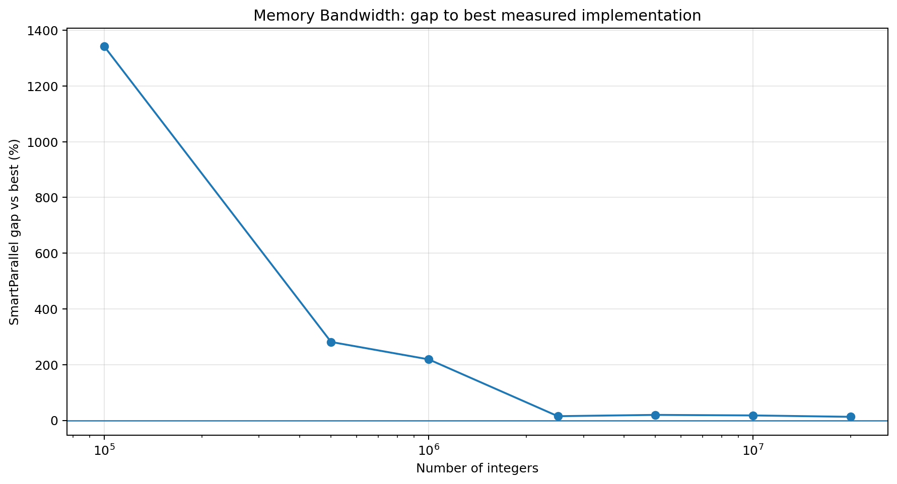
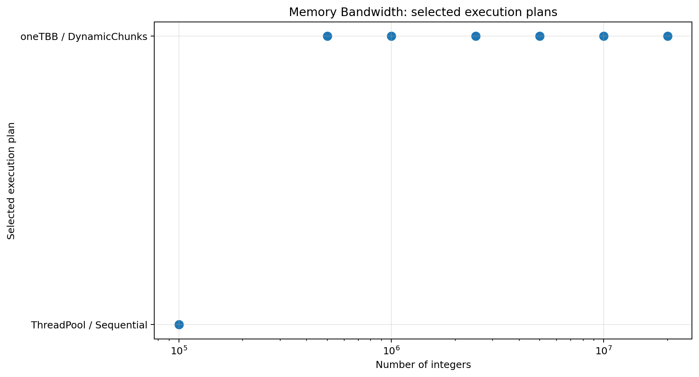

# Memory Bandwidth

## Purpose

Exposes memory-oriented workloads where iteration count alone is not enough to predict parallel benefit.

## Workload

A very cheap in-place integer transform over increasingly large contiguous arrays.

## Implementations compared

- sequential loop
- raw `std::thread` chunking
- SmartParallel static-thread execution
- direct oneTBB execution
- SmartParallel automatic execution

## Run

From the repository root, compile with the same Release configuration used for the other benchmarks, then run:

```powershell
.\benchmarks\memory_bandwidth\memory_bandwidth_benchmark.exe
```

The program writes `output/beta_1_0/results.csv`. Regenerate all figures with:

```powershell
py benchmarks\plot_all.py
```

## Results











## Interpretation

This is a documented Beta 1.0 limitation. Sequential execution remains best through one million elements, yet the framework can switch to oneTBB earlier. Even at larger sizes, SmartParallel trails direct oneTBB more than in compute-heavy cases. Explicit memory classification and adaptive grain size are V2 priorities.

In the committed Beta 1.0 data, the largest case (`20,000,000`) reports a SmartParallel gap of **12.70%** and selects **oneTBB / DynamicChunks**.

## Notes

The committed CSV contains 7 benchmark cases from one development machine. Treat the figures as validation data for this version, not as universal performance guarantees.
