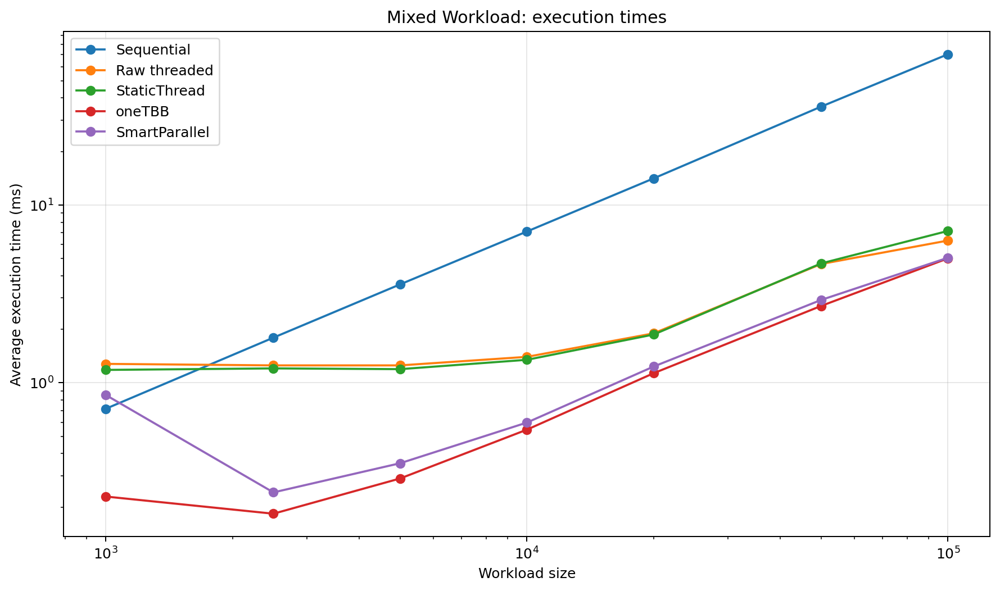
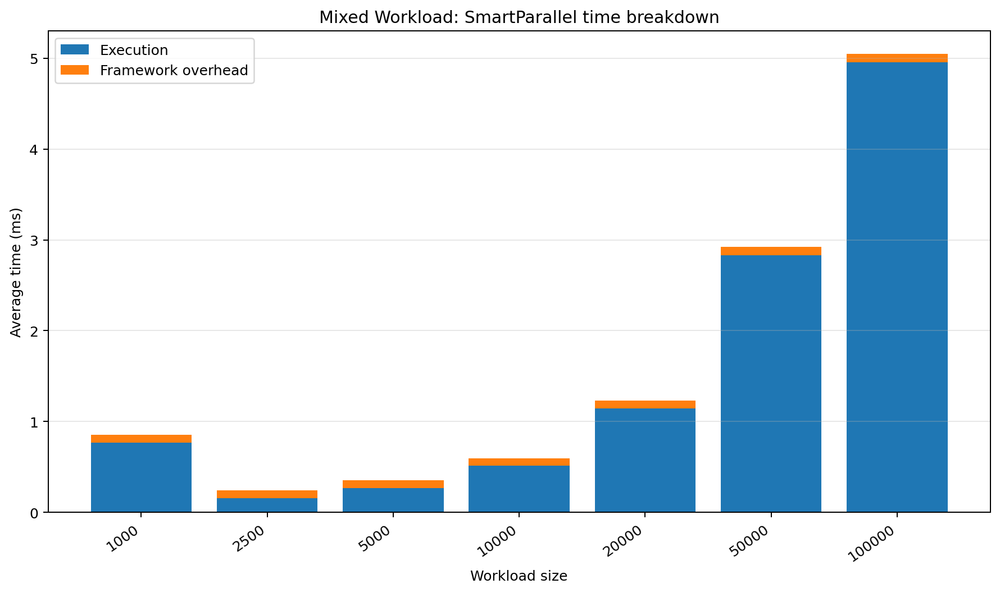
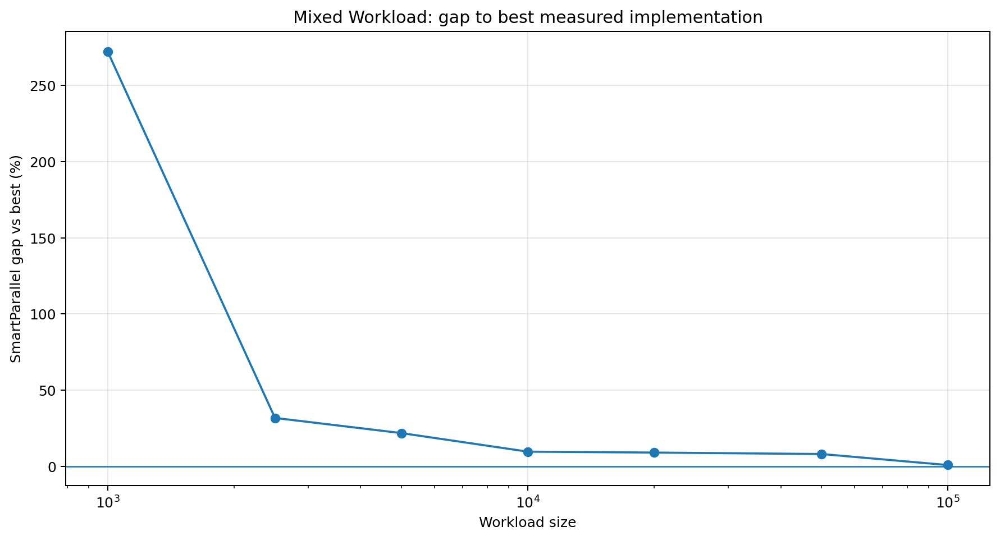
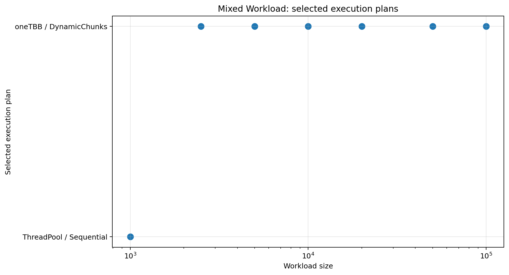

# Mixed Workload

## Purpose

Tests the transition from sequential to dynamic parallel execution for a nontrivial but not extreme kernel.

## Workload

Each value receives 64–127 square-root iterations, creating moderate cost variation.

## Implementations compared

- sequential loop
- raw `std::thread` chunking
- SmartParallel static-thread execution
- direct oneTBB execution
- SmartParallel automatic execution

## Run

From the repository root, compile with the same Release configuration used for the other benchmarks, then run:

```powershell
.\benchmarks\mixed_workload\mixed_workload_benchmark.exe
```

The program writes `output/beta_1_0/results.csv`. Regenerate all figures with:

```powershell
py benchmarks\plot_all.py
```

## Results









## Interpretation

The smallest case can remain sequential even when direct oneTBB wins; from larger sizes the plan switches to oneTBB and the gap falls as the fixed framework cost is amortized.

In the committed Beta 1.0 data, the largest case (`100,000`) reports a SmartParallel gap of **0.81%** and selects **oneTBB / DynamicChunks**.

## Notes

The committed CSV contains 7 benchmark cases from one development machine. Treat the figures as validation data for this version, not as universal performance guarantees.
