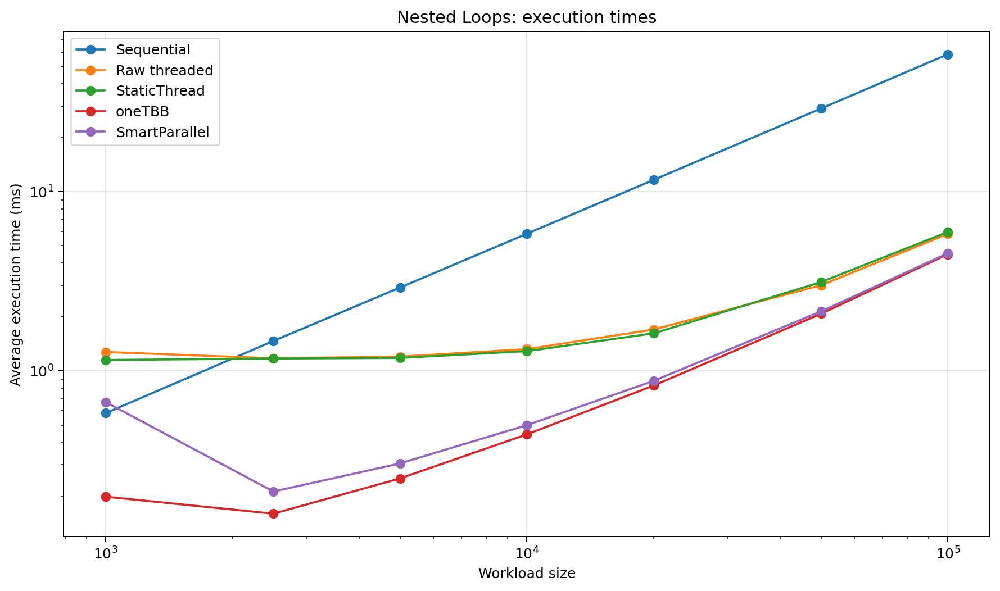
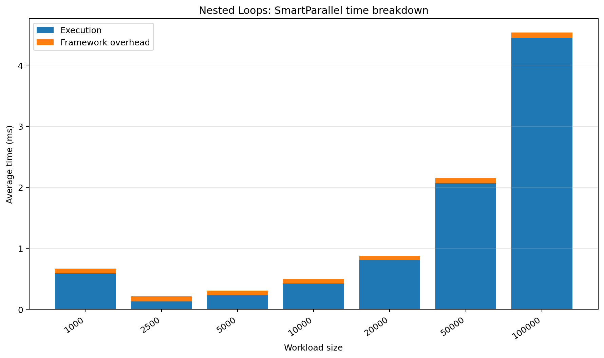
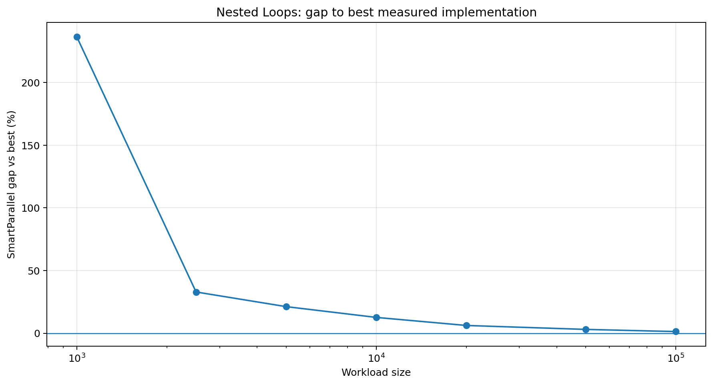
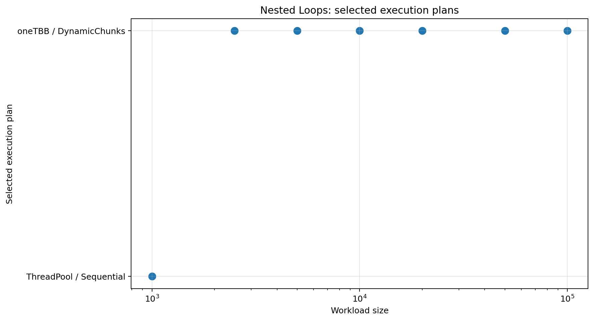

# Nested Loops

## Purpose

Validates regular range execution and the crossover from sequential to parallel scheduling.

## Workload

A regular compute kernel represented as a flattened iteration range.

## Implementations compared

- sequential loop
- raw `std::thread` chunking
- SmartParallel static-thread execution
- direct oneTBB execution
- SmartParallel automatic execution

## Run

From the repository root, compile with the same Release configuration used for the other benchmarks, then run:

```powershell
.\benchmarks\nested_loops\nested_loops_benchmark.exe
```

The program writes `output/beta_1_0/results.csv`. Regenerate all figures with:

```powershell
py benchmarks\plot_all.py
```

## Results









## Interpretation

The selected strategy changes to oneTBB for larger sizes. This benchmark currently resembles a one-dimensional regular workload; its name refers to the intended nested-loop use case rather than a literal two-dimensional callback API.

In the committed Beta 1.0 data, the largest case (`100,000`) reports a SmartParallel gap of **1.32%** and selects **oneTBB / DynamicChunks**.

## Notes

The committed CSV contains 7 benchmark cases from one development machine. Treat the figures as validation data for this version, not as universal performance guarantees.
