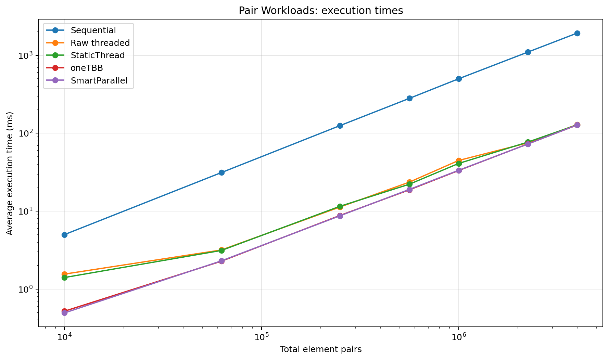
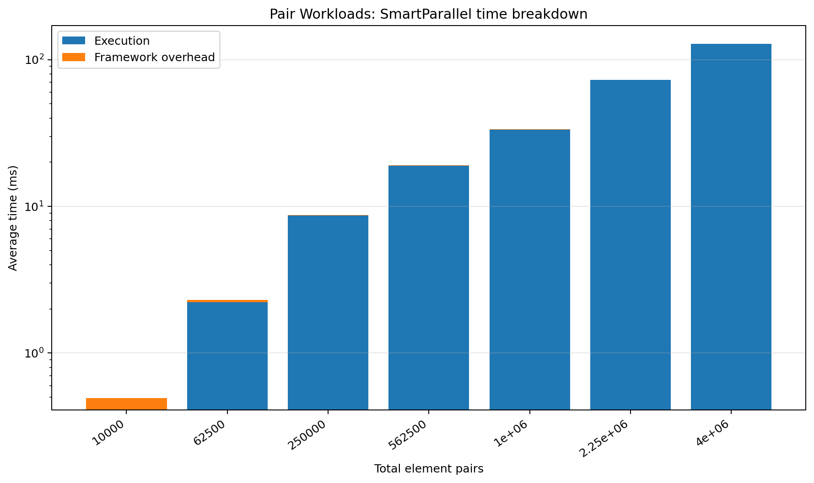
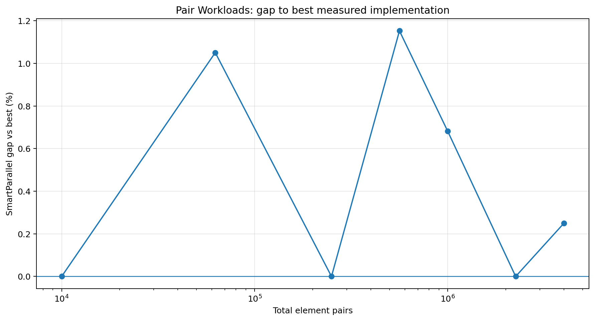
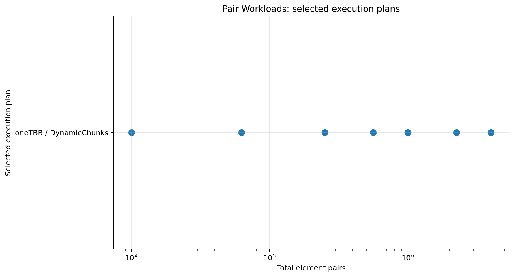

# Pair Workloads

## Purpose

Validates `for_each_pair`, index mapping, profiling, and execution of pairwise kernels.

## Workload

A Cartesian product of two containers, flattened into `size × size` pair operations.

## Implementations compared

- sequential loop
- raw `std::thread` chunking
- SmartParallel static-thread execution
- direct oneTBB execution
- SmartParallel automatic execution

## Run

From the repository root, compile with the same Release configuration used for the other benchmarks, then run:

```powershell
.\benchmarks\pair_workloads\pair_workloads_benchmark.exe
```

The program writes `output/beta_1_0/results.csv`. Regenerate all figures with:

```powershell
py benchmarks\plot_all.py
```

## Results









## Interpretation

SmartParallel consistently selects oneTBB dynamic execution. Framework overhead remains small compared with the rapidly growing pair count.

In the committed Beta 1.0 data, the largest case (`2,000`) reports a SmartParallel gap of **0.25%** and selects **oneTBB / DynamicChunks**.

## Notes

The committed CSV contains 7 benchmark cases from one development machine. Treat the figures as validation data for this version, not as universal performance guarantees.
