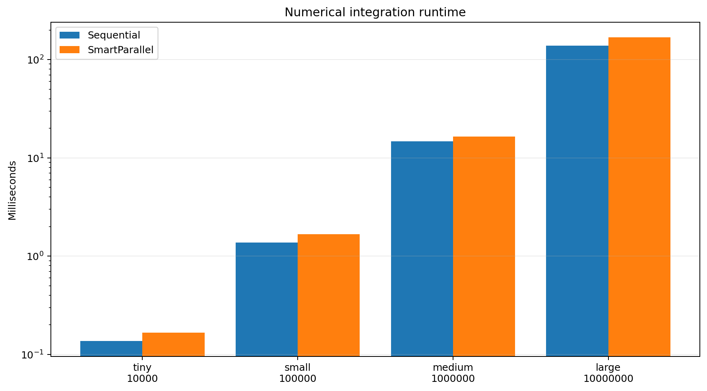
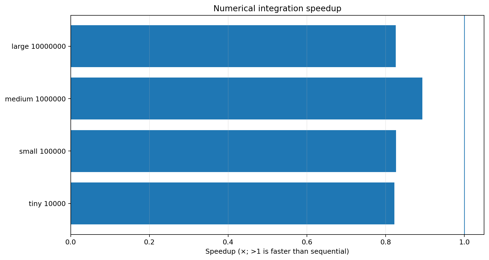
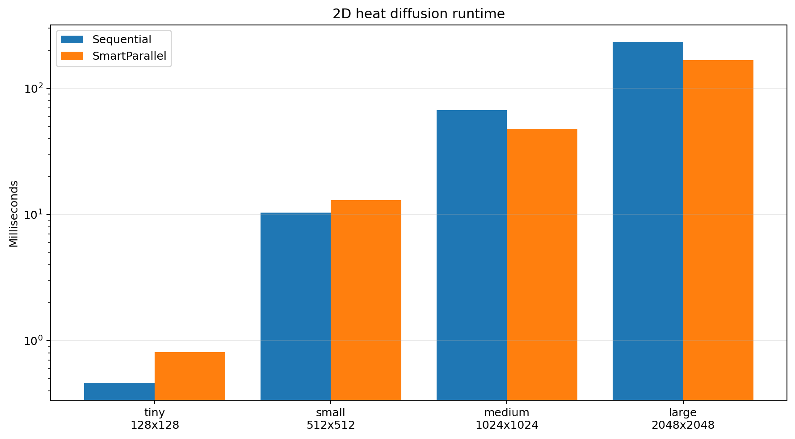
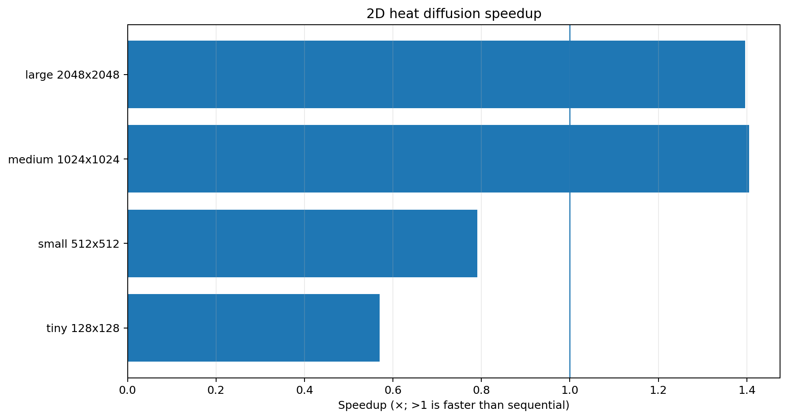
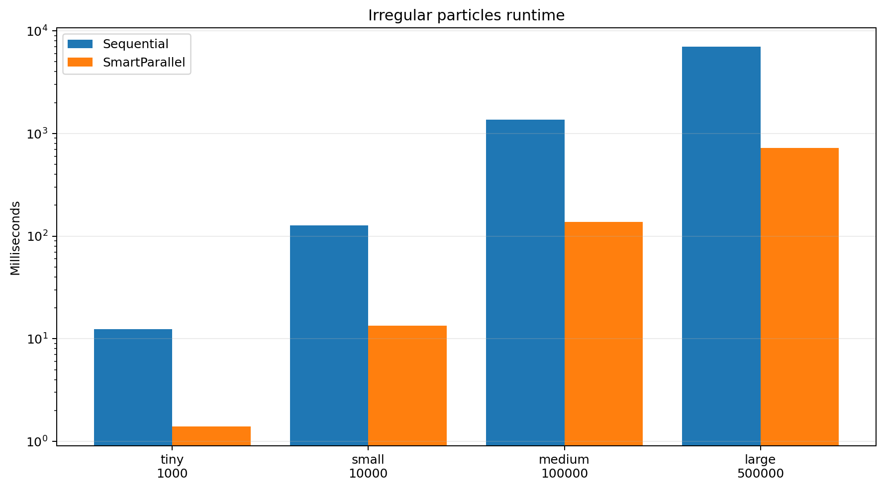
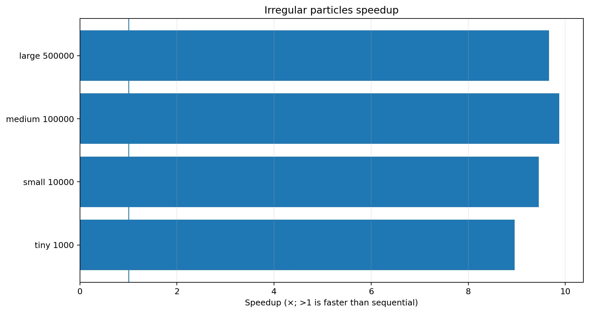

# Scientific benchmark results

The scientific suite covers a regular reduction-like loop, an iterative memory-sensitive stencil, and a highly irregular particle workload. Every recorded numerical check passed with zero difference between the sequential and SmartParallel outputs at the reported precision.

## Numerical integration





| Case | Intervals | Sequential ms | SmartParallel ms | Speedup | Strategy | Workers | Correct |
| --- | --- | --- | --- | --- | --- | --- | --- |
| tiny_10000 | 10000 | 0.137 | 0.166 | 0.82× | Sequential | 1 | yes |
| small_100000 | 100000 | 1.377 | 1.666 | 0.83× | Sequential | 1 | yes |
| medium_1000000 | 1000000 | 14.733 | 16.490 | 0.89× | Sequential | 1 | yes |
| large_10000000 | 10000000 | 139.197 | 168.535 | 0.83× | Sequential | 1 | yes |

SmartParallel selected its cached sequential fast path for every integration size. The adaptive wrapper added roughly 11–21% runtime in these measurements. This indicates that the loop is not a favorable parallel target under the recorded implementation and machine conditions; the result validates correctness and conservative backend selection, but also exposes wrapper overhead on a very regular low-cost body.

## 2D heat diffusion





| Case | Cells | Steps | Sequential ms | SmartParallel ms | Speedup | Strategy | Workers |
| --- | --- | --- | --- | --- | --- | --- | --- |
| tiny_128x128 | 16384 | 30 | 0.461 | 0.809 | 0.57× | Sequential | 1 |
| small_512x512 | 262144 | 40 | 10.321 | 13.053 | 0.79× | Sequential | 1 |
| medium_1024x1024 | 1048576 | 40 | 67.144 | 47.780 | 1.41× | DynamicChunks | 16 |
| large_2048x2048 | 4194304 | 30 | 233.635 | 167.278 | 1.40× | DynamicChunks | 16 |

The tiny and small grids remain faster sequentially. At 1024² and 2048² cells, SmartParallel switches to oneTBB dynamic chunks and records about **1.40×** speedup. This crossover illustrates the intended adaptive behavior for a bandwidth-sensitive stencil: parallelism is worthwhile only after the grid is large enough to amortize scheduling and synchronization.

## Irregular particles





| Case | Particles | Work units | Sequential ms | SmartParallel ms | Speedup | Strategy | Workers |
| --- | --- | --- | --- | --- | --- | --- | --- |
| tiny_1000 | 1000 | 269106 | 12.461 | 1.391 | 8.96× | DynamicChunks | 16 |
| small_10000 | 10000 | 2636807 | 126.561 | 13.386 | 9.45× | DynamicChunks | 16 |
| medium_100000 | 100000 | 26409877 | 1364.933 | 138.196 | 9.88× | DynamicChunks | 16 |
| large_500000 | 500000 | 131877401 | 7003.165 | 724.501 | 9.67× | DynamicChunks | 16 |

This is the strongest scientific result. Dynamic scheduling maintains **8.96–9.88×** speedup across a 500× increase in particle count, while preserving exact recorded checksums. The workload's per-particle cost varies from 16 to 511 work units, making it a natural fit for dynamic load balancing.

## Run

```bat
benchmarks\scientific\scripts\run_scientific_suite.bat
```

Raw snapshot files: [`../results/data`](../results/data).
