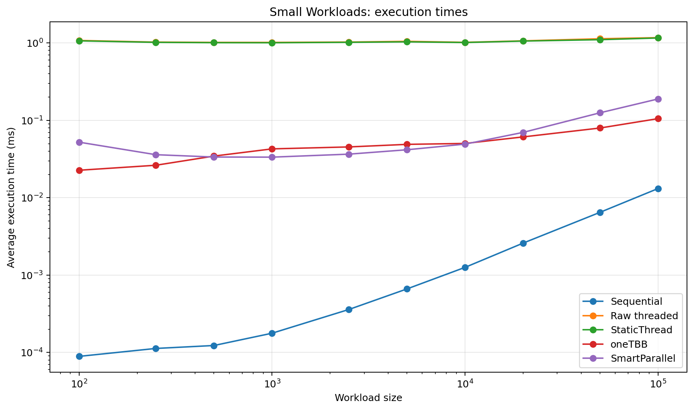
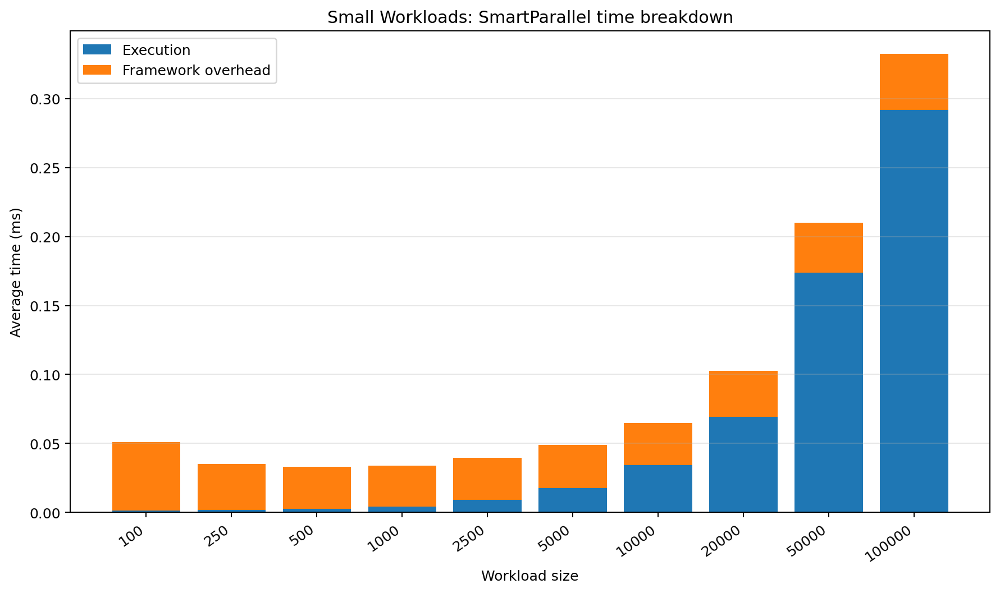
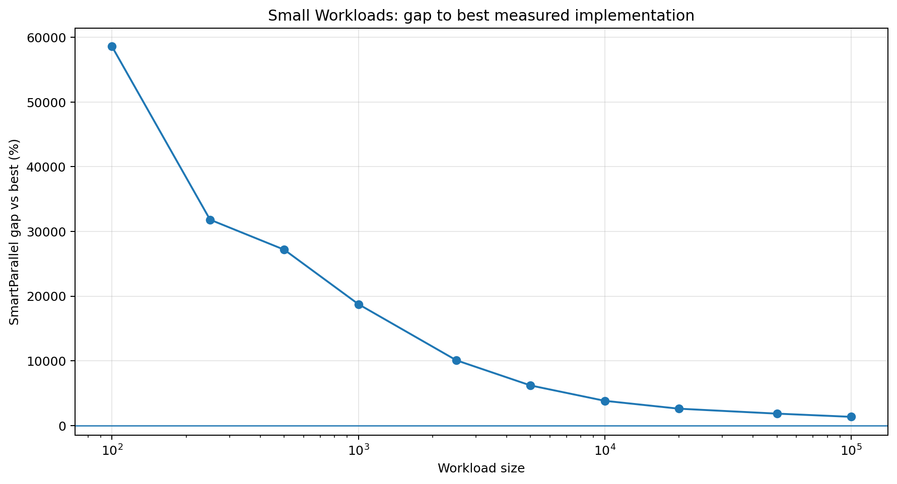
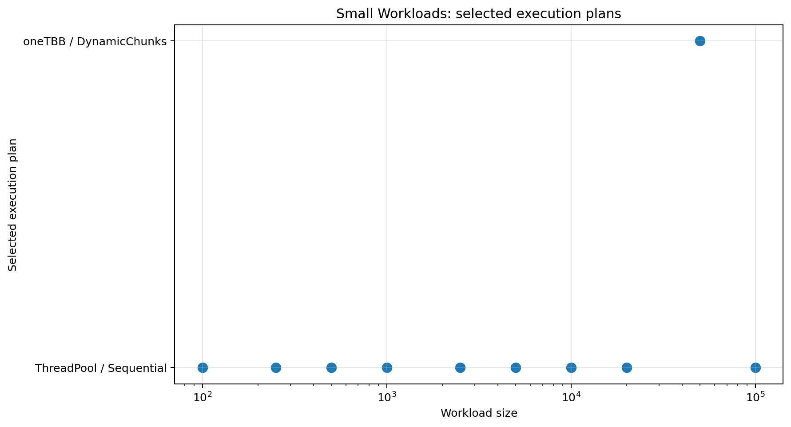

# Small Workloads

## Purpose

Validates that the decision system recognizes when parallel scheduling would cost more than the work itself.

## Workload

A trivial integer increment across very small to modest containers.

## Implementations compared

- sequential loop
- raw `std::thread` chunking
- SmartParallel static-thread execution
- direct oneTBB execution
- SmartParallel automatic execution

## Run

From the repository root, compile with the same Release configuration used for the other benchmarks, then run:

```powershell
.\benchmarks\small_workloads\small_workloads_benchmark.exe
```

The program writes `output/beta_1_0/results.csv`. Regenerate all figures with:

```powershell
py benchmarks\plot_all.py
```

## Results









## Interpretation

The selected plan is predominantly sequential. Percentage gaps are extremely large because direct sequential loops take fractions of a microsecond while profiling and decision work takes tens of microseconds. The absolute overhead is the meaningful value.

In the committed Beta 1.0 data, the largest case (`100,000`) reports a SmartParallel gap of **1337.42%** and selects **ThreadPool / Sequential**.

## Notes

The committed CSV contains 10 benchmark cases from one development machine. Treat the figures as validation data for this version, not as universal performance guarantees.
