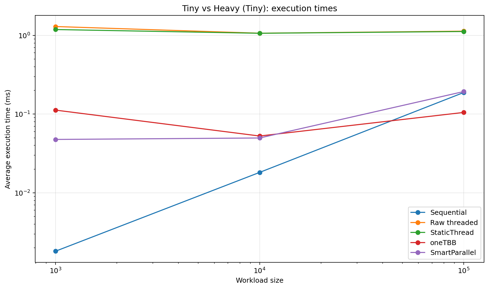
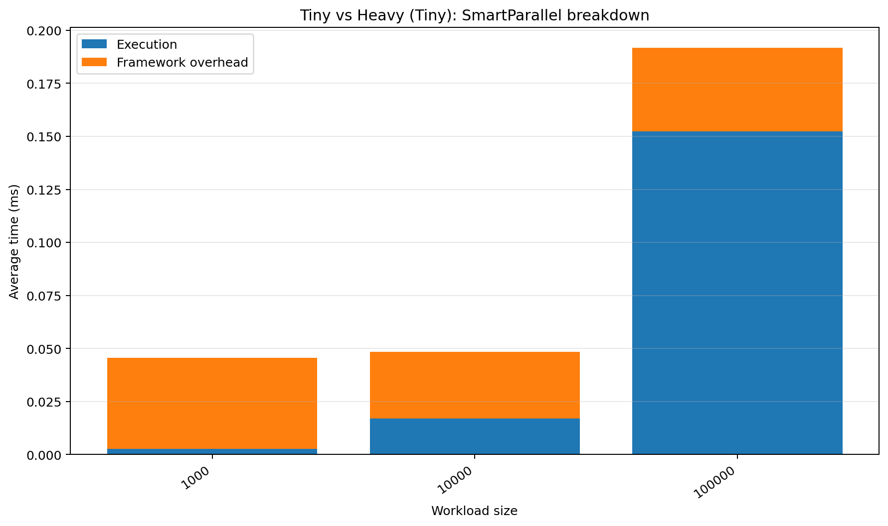
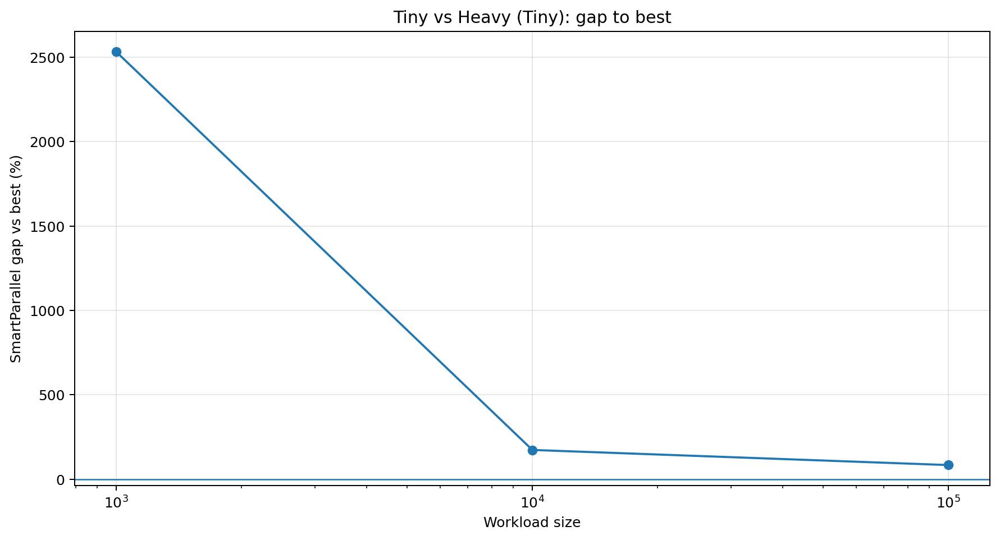
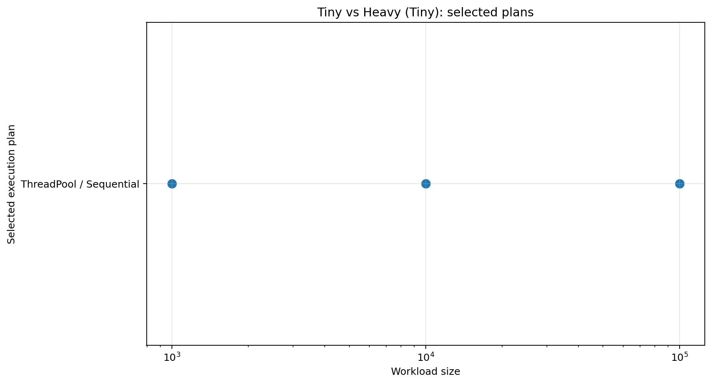
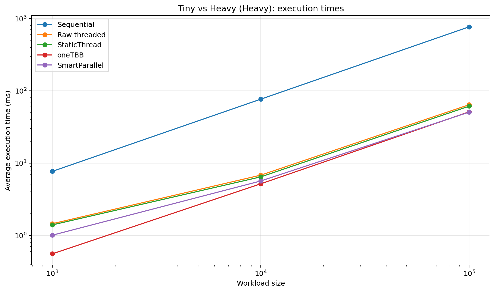
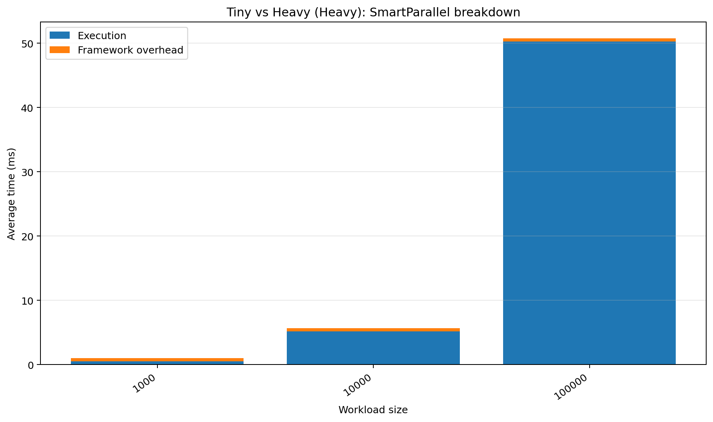
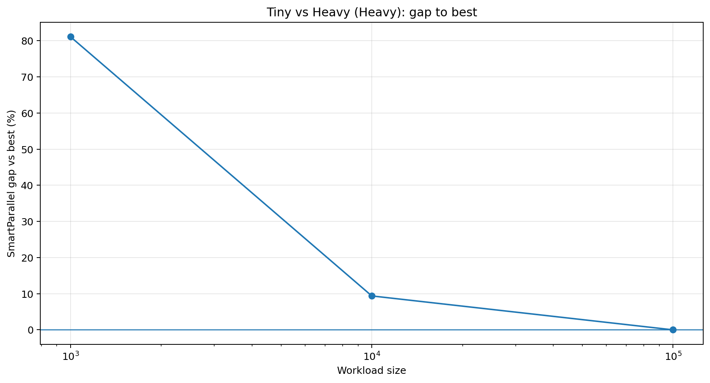
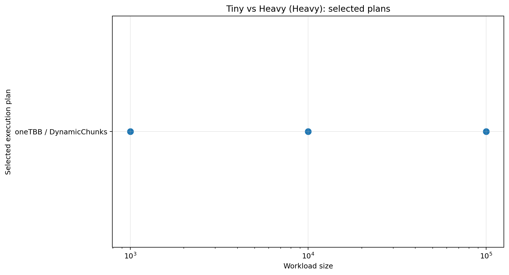

# Tiny vs Heavy Functions

## Purpose

Demonstrates that decisions depend on function cost, not only iteration count.

## Workload

Runs a trivial increment and an expensive square-root kernel at identical container sizes.

## Implementations compared

- sequential loop
- raw `std::thread` chunking
- SmartParallel static-thread execution
- direct oneTBB execution
- SmartParallel automatic execution

## Run

From the repository root, compile with the same Release configuration used for the other benchmarks, then run:

```powershell
.\benchmarks\tiny_vs_heavy\tiny_vs_heavy_benchmark.exe
```

The program writes `output/beta_1_0/results.csv`. Regenerate all figures with:

```powershell
py benchmarks\plot_all.py
```

## Results

















## Interpretation

Tiny callbacks are commonly kept sequential while heavy callbacks use oneTBB. This benchmark is the clearest validation of runtime function profiling.

In the committed Beta 1.0 data, the largest case (`100,000`) reports a SmartParallel gap of **0.00%** and selects **oneTBB / DynamicChunks**.

## Notes

The committed CSV contains 6 benchmark cases from one development machine. Treat the figures as validation data for this version, not as universal performance guarantees.
