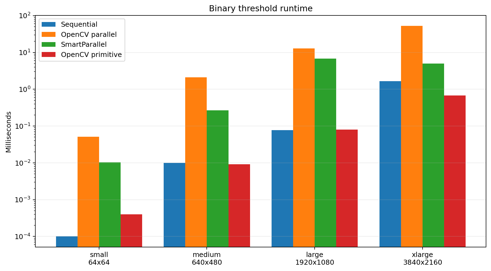
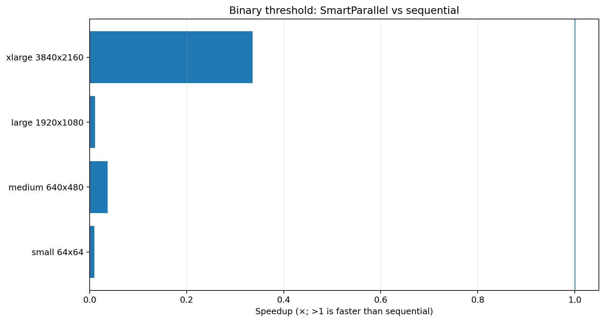
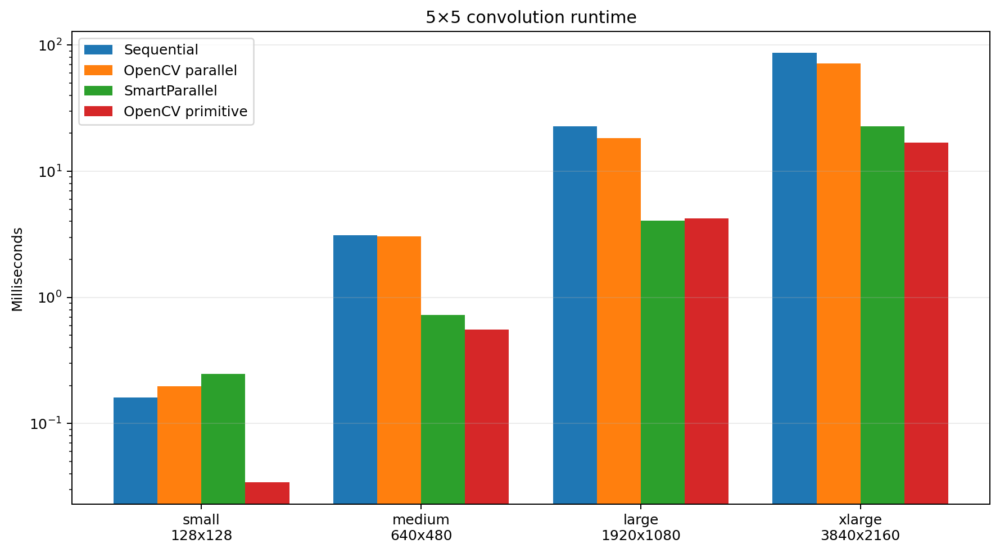
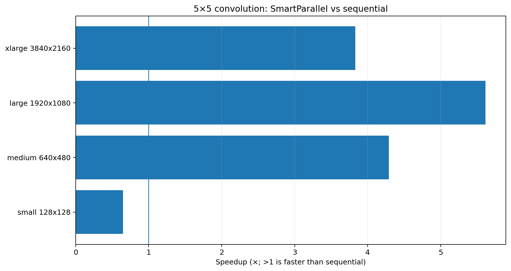
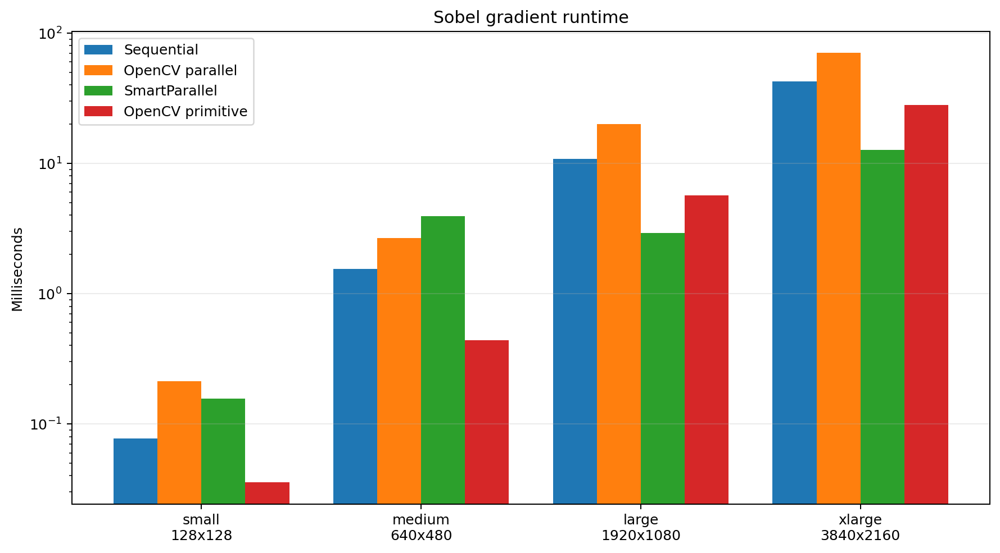
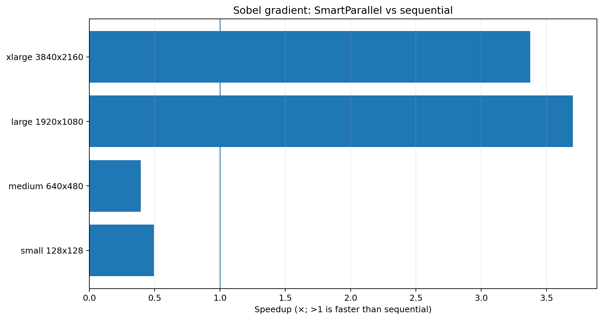
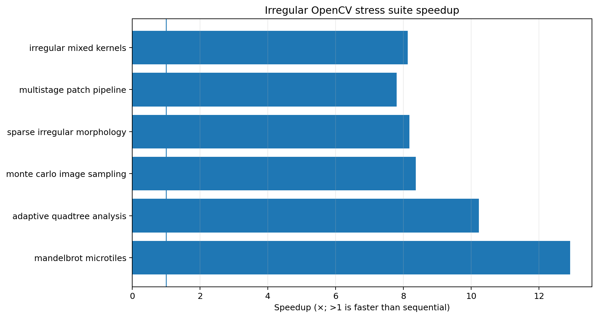
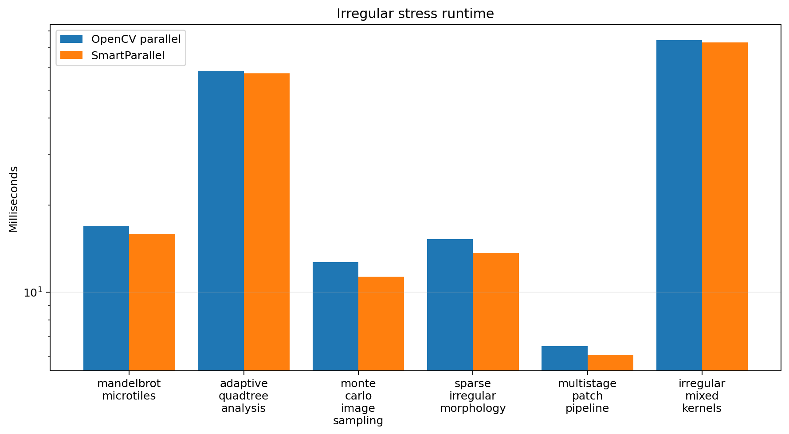

# OpenCV benchmark results

> **Historical v1.0 benchmark:** retained for reproducibility; see the [current v1.1 report](../../../docs/v1.1/benchmarks.md).

This suite evaluates three regular image kernels and six deliberately irregular workloads. All rows in the recorded CSVs passed their correctness checks.

## Summary

| Workload | Best recorded SmartParallel speedup vs sequential | Main observation |
| --- | ---: | --- |
| Binary threshold | 0.34× | The kernel is so cheap that scheduler overhead dominates; specialized `cv::threshold` remains the appropriate baseline. |
| 5×5 convolution | 5.61× | SmartParallel scales well from VGA upward and slightly beats `filter2D` at 1080p in this run. |
| Sobel magnitude | 3.70× | Parallelism becomes beneficial at 1080p and above; small cases remain sequential-sensitive. |
| Irregular stress suite | 12.92× | Dynamic oneTBB scheduling consistently achieves 7.81–12.92× speedup. |

## Binary threshold





| Case | Pixels | Sequential ms | SmartParallel ms | cv::threshold ms | Speedup | Selected plan |
| --- | --- | --- | --- | --- | --- | --- |
| small_64x64 | 4096 | 0.000 | 0.010 | 0.000 | 0.01× | Sequential |
| medium_640x480 | 307200 | 0.010 | 0.269 | 0.009 | 0.04× | oneTBB/DynamicChunks/w16/c0 |
| large_1920x1080 | 2073600 | 0.077 | 6.749 | 0.081 | 0.01× | Sequential |
| xlarge_3840x2160 | 8294400 | 1.661 | 4.946 | 0.679 | 0.34× | oneTBB/DynamicChunks/w16/c0 |

**Interpretation.** The direct scalar threshold implementation is extremely fast in this snapshot. SmartParallel therefore cannot amortize its execution machinery, even when it avoids OpenCV's much heavier generic parallel path. This is a useful negative result: cheap vectorizable primitives should generally remain specialized operations rather than scheduler benchmarks.

## 5×5 convolution





| Case | Pixels | Sequential ms | SmartParallel ms | filter2D ms | Speedup | Selected plan |
| --- | --- | --- | --- | --- | --- | --- |
| small_128x128 | 16384 | 0.161 | 0.248 | 0.034 | 0.65× | Sequential |
| medium_640x480 | 307200 | 3.119 | 0.727 | 0.554 | 4.29× | oneTBB/DynamicChunks/w16/c0 |
| large_1920x1080 | 2073600 | 22.716 | 4.047 | 4.222 | 5.61× | oneTBB/DynamicChunks/w16/c0 |
| xlarge_3840x2160 | 8294400 | 86.915 | 22.692 | 16.909 | 3.83× | oneTBB/DynamicChunks/w16/c0 |

**Interpretation.** After the 128×128 case, SmartParallel chooses dynamic oneTBB execution and records 3.83–5.61× speedup over the direct sequential loop. The specialized OpenCV primitive is still strongest at the largest 4K case, while SmartParallel is slightly faster at 1080p in this run.

## Sobel gradient magnitude





| Case | Pixels | Sequential ms | SmartParallel ms | cv::Sobel ms | Speedup | Selected plan |
| --- | --- | --- | --- | --- | --- | --- |
| small_128x128 | 16384 | 0.077 | 0.156 | 0.035 | 0.49× | Sequential |
| medium_640x480 | 307200 | 1.546 | 3.931 | 0.439 | 0.39× | Sequential |
| large_1920x1080 | 2073600 | 10.845 | 2.929 | 5.698 | 3.70× | oneTBB/DynamicChunks/w16/c0 |
| xlarge_3840x2160 | 8294400 | 42.711 | 12.646 | 28.042 | 3.38× | oneTBB/DynamicChunks/w16/c0 |

**Interpretation.** The selected sequential plan is competitive only for the smallest image. The medium case is a recorded decision/performance miss, whereas 1080p and 4K obtain 3.38–3.70× speedup and substantially outperform the generic OpenCV parallel-loop comparison. `cv::Sobel` remains a specialized optimized reference.

## Irregular stress suite





| Benchmark | Items | Sequential ms | OpenCV parallel ms | SmartParallel ms | Vs sequential | Vs OpenCV |
| --- | --- | --- | --- | --- | --- | --- |
| mandelbrot_microtiles | 65536 | 205.308 | 16.938 | 15.892 | 12.92× | 1.07× |
| adaptive_quadtree_analysis | 131072 | 583.578 | 58.240 | 57.038 | 10.23× | 1.02× |
| monte_carlo_image_sampling | 262144 | 94.443 | 12.693 | 11.290 | 8.37× | 1.12× |
| sparse_irregular_morphology | 262144 | 111.684 | 15.239 | 13.662 | 8.18× | 1.12× |
| multistage_patch_pipeline | 131072 | 47.261 | 6.511 | 6.054 | 7.81× | 1.08× |
| irregular_mixed_kernels | 196608 | 594.552 | 74.310 | 73.107 | 8.13× | 1.02× |

Across all six irregular workloads, SmartParallel selected `oneTBB/DynamicChunks/w16` and was both correct and faster than the compared OpenCV parallel implementation. The gain over OpenCV is modest (1.02–1.12×), but the gain over sequential execution is large and consistent.

## Run

```bat
scripts\benchmarks\run_opencv_benchmarks.bat
```

Raw snapshot files: [`../results/data`](../results/data).
