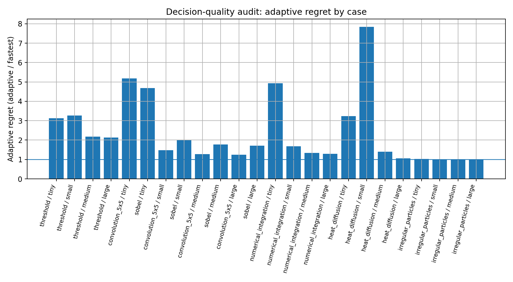
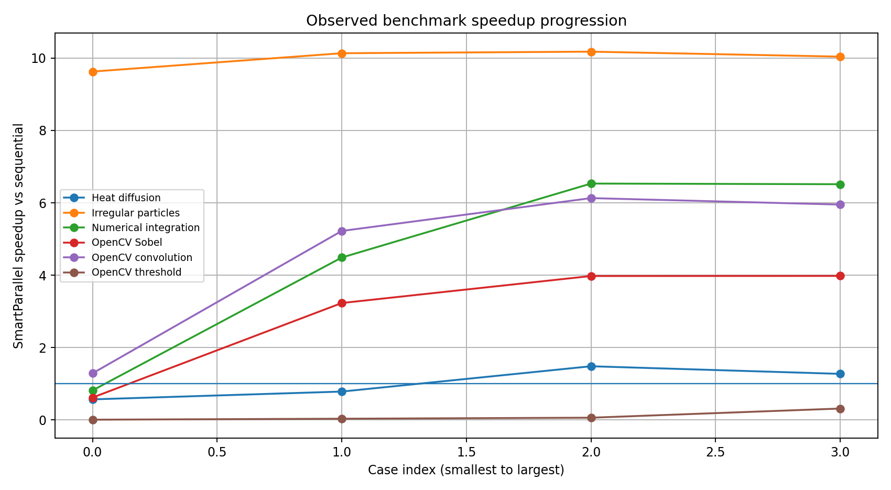
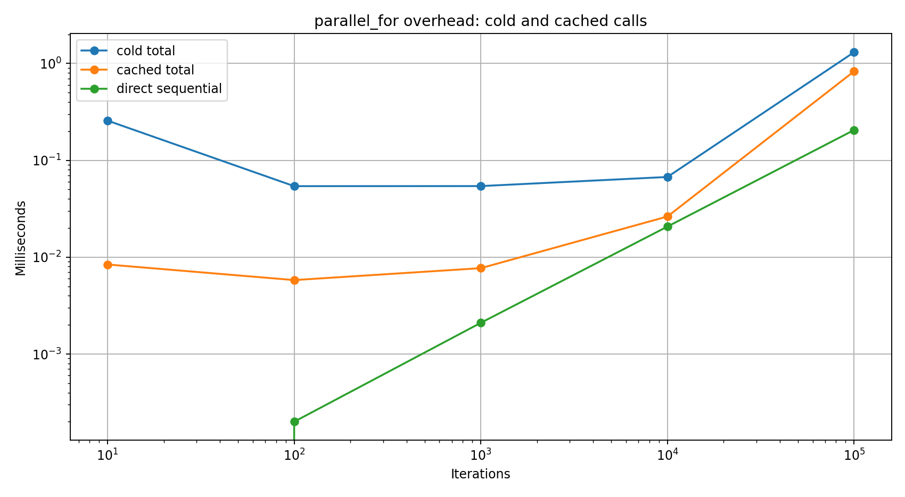
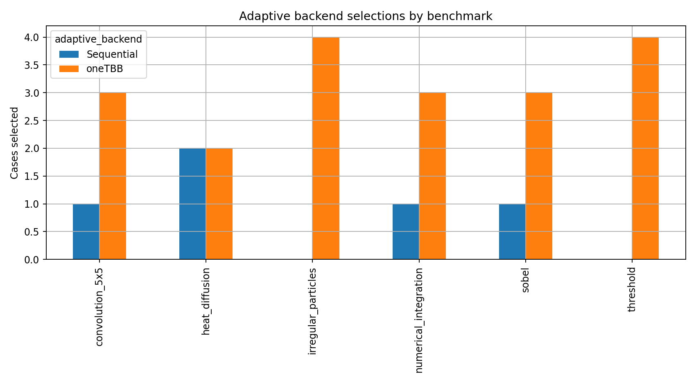

# Recorded benchmark results

This page summarizes the CSV files committed under `validation/output/`. The measurements are evidence from the recorded environment, not portable guarantees.

## Correctness

All recorded rows in the following suites report successful correctness checks:

- OpenCV threshold, convolution, and Sobel;
- OpenCV stress suite;
- numerical integration;
- heat diffusion;
- irregular particles;
- all-domain decision-quality audit.

## Decision quality

- Correct backend selections: **18/24 (75%)**
- Median adaptive regret: **1.69x**
- Mean adaptive regret: **2.37x**
- Worst recorded regret: **7.85x**

The six backend-selection misses are concentrated in tiny or small cases:

| Benchmark | Case | Fastest forced backend | Adaptive backend | Regret |
|---|---|---|---|---:|
| threshold | tiny | Sequential | oneTBB | 3.12x |
| convolution_5x5 | tiny | oneTBB | Sequential | 5.18x |
| sobel | tiny | oneTBB | Sequential | 4.68x |
| numerical_integration | tiny | oneTBB | Sequential | 4.94x |
| heat_diffusion | tiny | oneTBB | Sequential | 3.23x |
| heat_diffusion | small | oneTBB | Sequential | 7.85x |

This is expected to remain visible in v1. For tiny work, profiling, decision, and dispatch can exceed useful execution time. It is a known optimization target rather than a correctness problem.

## OpenCV observations

- Every output check passed.
- Convolution and Sobel show strong scaling as image size grows.
- Threshold is deliberately so cheap that the adaptive framework is slower than a direct scalar loop in the recorded cases, although it can outperform the measured OpenCV parallel loop.
- The stress suite reached a maximum recorded SmartParallel-versus-sequential speedup of **12.86x**.

## Scientific observations

- Numerical integration reached **6.53x**.
- Heat diffusion reached **1.49x** and illustrates that memory-heavy stencils need enough problem size to amortize parallel overhead.
- Irregular particles reached **10.18x**, consistently favoring oneTBB dynamic scheduling.

## Overhead

Cold calls include cache lookup, workload analysis, callback profiling, decision ranking, and execution. Cached cheap callbacks can enter the confirmed sequential fast path, sharply reducing repeat-call framework cost.

## Backend selection profile

For exact values and additional columns, use the CSV files directly.
