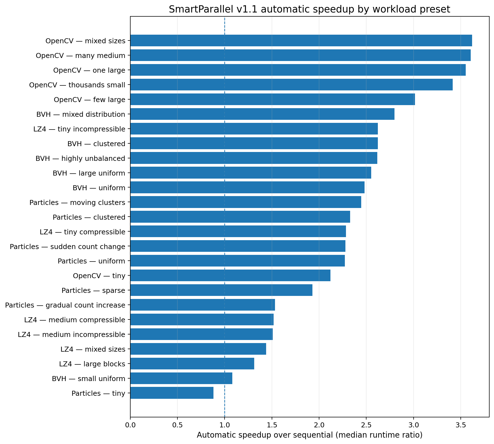
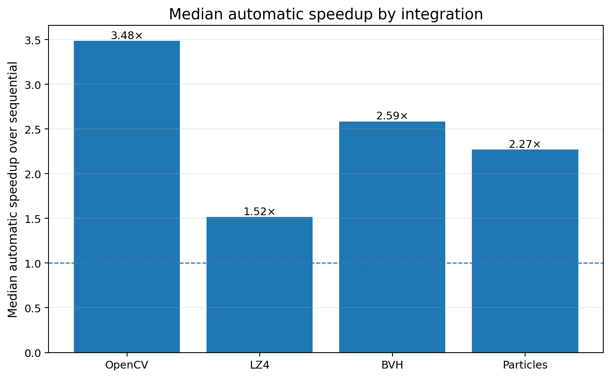
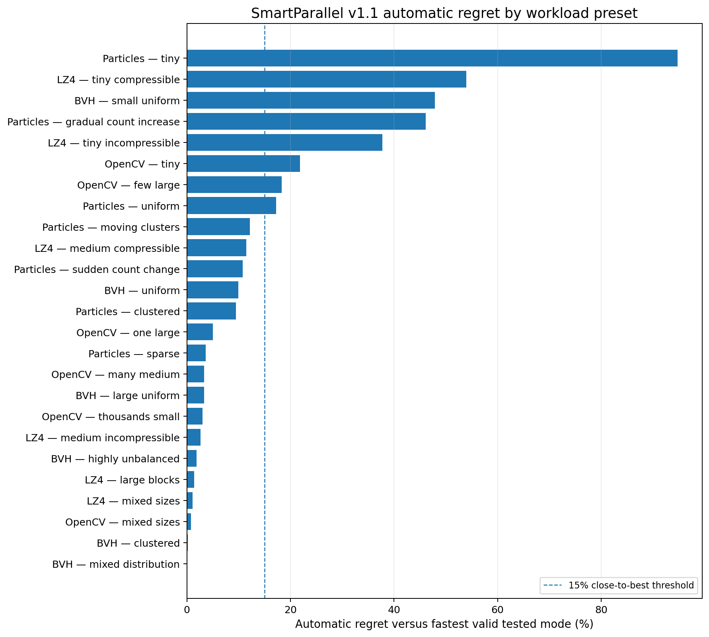
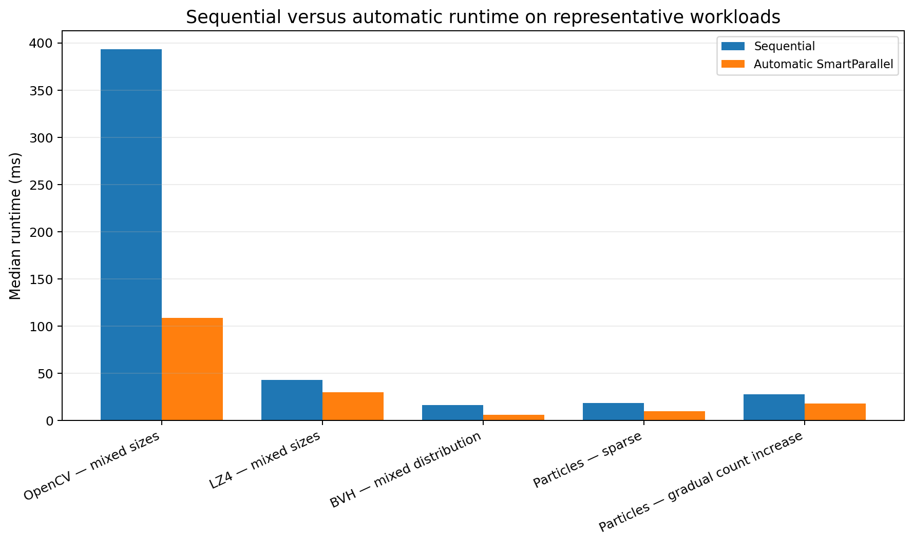
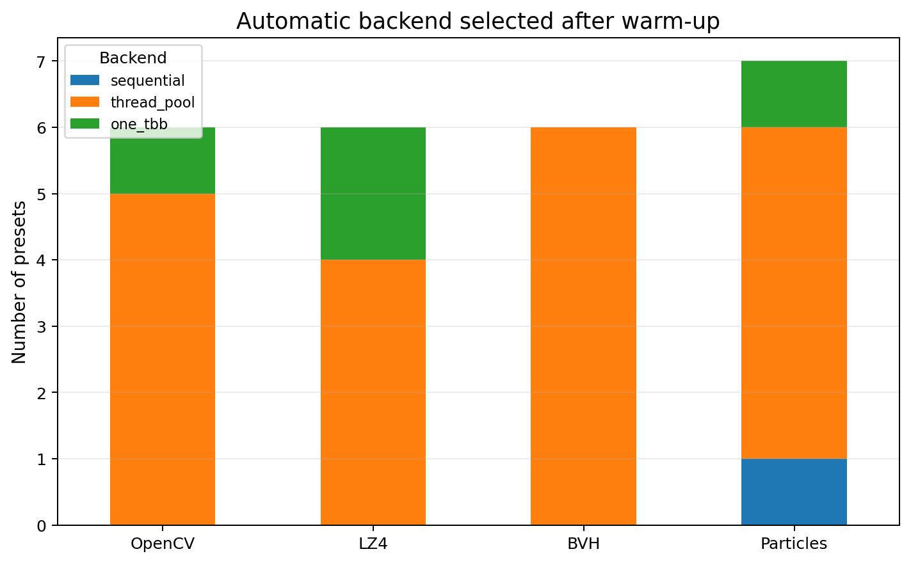

# Real-world benchmark results

> **Current documentation:** SmartParallel v1.1.0.

> Final SmartParallel v1.1.0 release run. Values are calculated from
> `validation/output/real_world/v1.1.0_real_world_auto_analysis.csv` and the matching per-integration CSVs.

Across the final real-world suite, SmartParallel automatically achieved substantial speedups on image processing, compression, recursive construction, and dynamic simulation workloads while preserving correctness and respecting nested concurrency limits.

## Release summary

For the 20 presets whose automatic median runtime was at least 1 ms:

- automatic execution beat sequential execution in **20/20** cases;
- geometric-mean speedup over sequential was **2.33×**;
- **17/20** were within 15% of the fastest valid tested strategy;
- **19/20** were within 20% of the fastest valid tested strategy;
- median regret was **3.47%**.

Across all 25 presets, including five sub-millisecond cases, automatic execution beat sequential in **24/25** cases. High percentage regret on tiny cases often represented less than one millisecond of absolute difference.

| Integration | Presets | Geometric-mean speedup | Median speedup | Median regret | Within 15% of best |
|---|---:|---:|---:|---:|---:|
| OpenCV image pipelines | 6 | 3.17× | 3.48× | 4.17% | 4/6 |
| LZ4 batch compression | 6 | 1.72× | 1.52× | 7.03% | 4/6 |
| BVH construction | 6 | 2.26× | 2.59× | 2.61% | 5/6 |
| Particle simulation | 7 | 1.86× | 2.27× | 12.15% | 4/7 |

*Median automatic speedup over sequential for every preset. Source: `v1.1.0_real_world_auto_analysis.csv`.*

*Median of per-preset automatic speedups within each integration. Source: `v1.1.0_real_world_auto_analysis.csv`.*

## Workloads and results

### OpenCV image pipelines

Applies deterministic image-processing pipelines to batches ranging from one large image to thousands of small images. The benchmark exposes both image-level and tile-level nesting while OpenCV internal threading is restricted to one thread.

**Correctness:** Output hashes, exact-once counters, and aggregate checksums are compared with the deterministic reference.

| Preset | Sequential median | Automatic median | Speedup | Regret vs best | Automatic backend | Frontier |
|---|---:|---:|---:|---:|---|---|
| `few_large` | 98.2416 ms | 32.5723 ms | 3.02× | 18.32% (5.0436 ms) | `thread_pool` | `L1` |
| `many_medium` | 302.0724 ms | 83.7680 ms | 3.61× | 3.35% (2.7138 ms) | `thread_pool` | `L1` |
| `mixed_sizes` | 393.3491 ms | 108.6415 ms | 3.62× | 0.79% (0.8495 ms) | `thread_pool` | `L1` |
| `one_large` | 62.0478 ms | 17.4631 ms | 3.55× | 4.99% (0.8306 ms) | `thread_pool` | `L1` |
| `thousands_small` | 98.9306 ms | 28.9627 ms | 3.42× | 2.99% (0.8412 ms) | `one_tbb` | `L1` |
| `tiny` | 0.5458 ms | 0.2573 ms | 2.12× | 21.83% (0.0461 ms) | `thread_pool` | `L1` |

**Interpretation:** mixed sizes, many-medium, one-large, and thousands-small were close to the fastest tested plan. `few_large` retained measurable regret because a small number of coarse image pipelines can leave a terminal straggler. The tiny case had only 0.0461 ms absolute regret.

### LZ4 batch compression

Compresses and decompresses independent blocks with compressible, incompressible, large, tiny, and mixed-size corpora. It represents flat batch parallelism with changing work per item and memory-bandwidth pressure.

**Correctness:** Every block is executed once, decompressed byte-for-byte, and included in the final checksum.

| Preset | Sequential median | Automatic median | Speedup | Regret vs best | Automatic backend | Frontier |
|---|---:|---:|---:|---:|---|---|
| `large_blocks` | 12.6371 ms | 9.6156 ms | 1.31× | 1.37% (0.1303 ms) | `thread_pool` | `L1` |
| `medium_compressible` | 3.1447 ms | 2.0691 ms | 1.52× | 11.45% (0.2126 ms) | `thread_pool` | `L1` |
| `medium_incompressible` | 5.0684 ms | 3.3562 ms | 1.51× | 2.62% (0.0856 ms) | `thread_pool` | `L1` |
| `mixed_sizes` | 42.8866 ms | 29.8057 ms | 1.44× | 1.09% (0.3208 ms) | `thread_pool` | `L1` |
| `tiny_compressible` | 1.5157 ms | 0.6637 ms | 2.28× | 53.99% (0.2327 ms) | `one_tbb` | `L1` |
| `tiny_incompressible` | 1.8090 ms | 0.6895 ms | 2.62× | 37.76% (0.1890 ms) | `one_tbb` | `L1` |

**Interpretation:** medium, large, and mixed block corpora were close to the fastest tested mode. Tiny-block percentage regret was high, but the absolute differences were 0.2327 ms and 0.1890 ms while automatic still exceeded 2× sequential speedup.

### BVH construction

Builds a custom median-split bounding-volume hierarchy over deterministic primitive distributions, including clustered and highly unbalanced inputs. It is a recursive workload with branch skew and nested construction opportunities.

**Correctness:** Tree structure, primitive occurrence, bounds, traversal counts against brute force, cancellation recovery, and checksums are validated.

| Preset | Sequential median | Automatic median | Speedup | Regret vs best | Automatic backend | Frontier |
|---|---:|---:|---:|---:|---|---|
| `clustered` | 8.0917 ms | 3.0842 ms | 2.62× | 0.20% (0.0061 ms) | `thread_pool` | `L1` |
| `highly_unbalanced` | 7.2268 ms | 2.7616 ms | 2.62× | 1.90% (0.0515 ms) | `thread_pool` | `L1` |
| `large_uniform` | 56.4550 ms | 22.1121 ms | 2.55× | 3.32% (0.7114 ms) | `thread_pool` | `L1` |
| `mixed_distribution` | 16.4292 ms | 5.8698 ms | 2.80× | 0.00% (0.0000 ms) | `thread_pool` | `L1` |
| `small_uniform` | 0.1217 ms | 0.1127 ms | 1.08× | 47.90% (0.0365 ms) | `thread_pool` | `L1` |
| `uniform` | 8.3122 ms | 3.3489 ms | 2.48× | 9.94% (0.3027 ms) | `thread_pool` | `L1` |

**Interpretation:** clustered, highly unbalanced, large, mixed, and uniform recursive builds all achieved strong automatic speedups. The small case had 0.0365 ms absolute regret, so its 47.9% percentage regret should not be interpreted as a material regression.

### Particle simulation

Runs a custom uniform-grid neighbor-force simulation across repeated frames, including sparse, clustered, moving-cluster, sudden-count, and gradual-count scenarios. It stresses nested calls, stable-plan reuse, and workload drift.

**Correctness:** The final state is compared with a deterministic sequential reference using absolute tolerance 1e-11 and a quantized checksum.

| Preset | Sequential median | Automatic median | Speedup | Regret vs best | Automatic backend | Frontier |
|---|---:|---:|---:|---:|---|---|
| `clustered` | 34.2093 ms | 14.6845 ms | 2.33× | 9.49% (1.2730 ms) | `thread_pool` | `L1` |
| `gradual_count_increase` | 27.9861 ms | 18.2402 ms | 1.53× | 46.12% (5.7571 ms) | `one_tbb` | `L1` |
| `moving_clusters` | 69.1984 ms | 28.2924 ms | 2.45× | 12.15% (3.0655 ms) | `thread_pool` | `L1` |
| `sparse` | 18.8502 ms | 9.7644 ms | 1.93× | 3.60% (0.3391 ms) | `thread_pool` | `L1` |
| `sudden_count_change` | 45.8986 ms | 20.1276 ms | 2.28× | 10.75% (1.9530 ms) | `thread_pool` | `L1` |
| `tiny` | 0.6509 ms | 0.7395 ms | 0.88× | 94.76% (0.3598 ms) | `sequential` | `none` |
| `uniform` | 31.9555 ms | 14.0670 ms | 2.27× | 17.23% (2.0672 ms) | `thread_pool` | `L1` |

**Interpretation:** particle scheduling was the most difficult integration during development. Final sparse, clustered, sudden-change, moving-cluster, and uniform cases improved substantially and remained stable. `gradual_count_increase` exposed the tradeoff between frozen steady-state calibration and a workload that changes throughout the timed sequence; production revalidation remains enabled outside the benchmark freeze. The tiny sequential case had 0.3598 ms absolute regret.

## Strategies compared

The comparison matrix retained sequential execution, manual ThreadPool/StaticThread/oneTBB modes, SmartParallel automatic and forced-backend modes, and—where the workload had nested structure—outer-only, inner-only, all-level, flattened, and automatic-frontier variants. The fastest valid mode was selected independently for every integration and preset.

*Automatic regret relative to the fastest correctness-valid tested mode. The dashed line marks the report's 15% close-to-best threshold. Source: `v1.1.0_real_world_auto_analysis.csv`.*

*Sequential and automatic median runtime for representative flat, recursive, irregular, and drift workloads. Source: `v1.1.0_real_world_auto_analysis.csv`.*

*Backend selected after warm-up for each preset. Source: `v1.1.0_real_world_auto_analysis.csv`.*

## Correctness, authenticity, and resource limits

- All 14,496 timed raw records in the final run passed workload correctness checks.
- Every exported trace record confirmed the backend that actually executed.
- Maximum recorded runtime concurrency and root leases remained four.
- The final traces contained no exceptional timed execution.
- Timed backend calibration and profile revalidation were frozen after warm-up to keep steady-state timing deterministic.

## Environment

| Item | Recorded value |
|---|---|
| SmartParallel | 1.1.0 |
| Benchmark commit | `f834709fc856` |
| Recorded timestamps | 2026-07-22 14:01:40Z–14:08:53Z |
| Compiler | MSVC 19.44 |
| Operating system | Windows |
| CPU | AMD64 Family 23 Model 8 Stepping 2, AuthenticAMD |
| Logical processors | 16 |
| SmartParallel worker limit | 4 |
| oneTBB | 2023.0.0 |
| OpenCV | 4.12.0 |
| Warm-ups / timed repetitions | 3 / 31 |
| Random seed | 1511505647 |

## Qualifications

- These measurements describe one machine and configuration; they are not universal guarantees.
- OpenCV and LZ4 use their external libraries. The BVH and particle programs are custom realistic benchmark implementations, not integrations into third-party engines.
- Input generation is deterministic and disk I/O is excluded.
- Relative regret is less informative for sub-millisecond cases; absolute regret is reported alongside it.
- Frozen timed-phase calibration measures steady-state execution. Production profile revalidation remains enabled and may incur adaptation cost when a workload changes.

## Reproduce the results and plots

See [benchmark reproduction](benchmark-reproduction.md). The generated numeric table is retained in [`assets/benchmarks/generated-results.md`](assets/benchmarks/generated-results.md), and machine-readable aggregate metrics are in [`assets/benchmarks/benchmark-metrics.json`](assets/benchmarks/benchmark-metrics.json).
