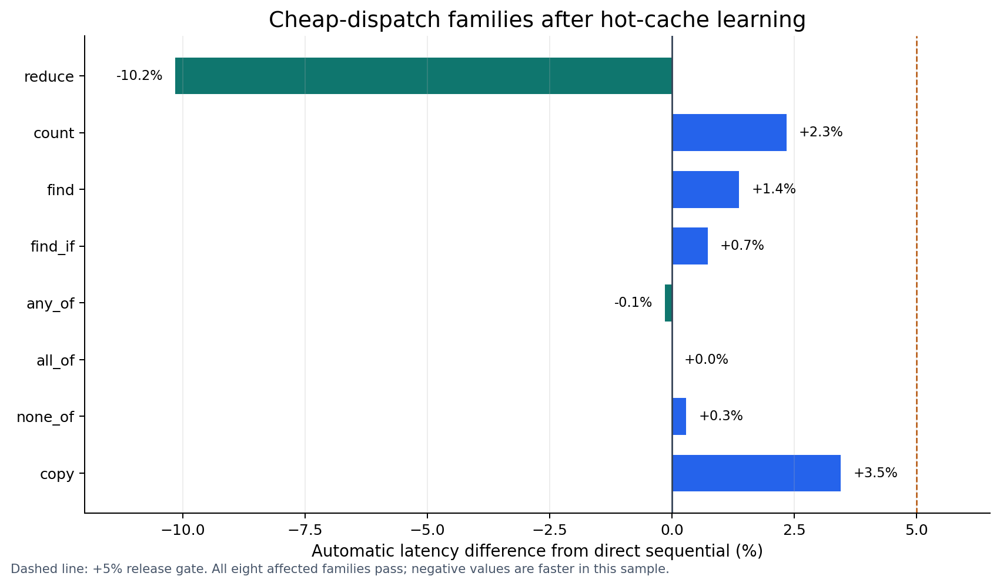
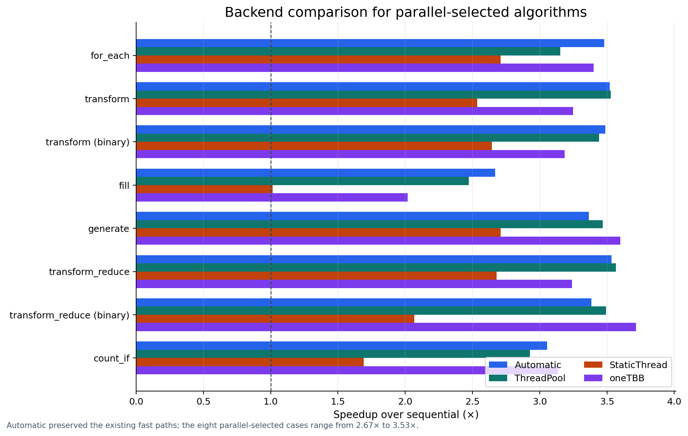

# SmartParallel v1.4 parallel-algorithm benchmark results

> Final accepted v1.4 benchmark snapshot. Values are calculated from
> [the retained accepted summary CSV](assets/benchmarks/accepted-summary.csv)
> and [matching raw samples](assets/benchmarks/accepted-raw.csv).

SmartParallel v1.4 adds fourteen public algorithm families, with separate unary and binary measurements for transform and transform-reduce. The final matrix contains sixteen benchmark cases across sequential, automatic, ThreadPool, StaticThread, and oneTBB modes.

## Release summary

The checked-in Windows/MSVC Release run produced:

- **80/80 summary rows** passing checksum correctness and backend authentication;
- **560/560 raw samples** passing the same validation;
- automatic ThreadPool execution for the eight compute-heavy cases;
- direct sequential hot dispatch for the eight cheap or bandwidth-sensitive cases;
- a **3.30× geometric-mean speedup** across the eight parallel-selected cases;
- automatic speedups ranging from **2.67× to 3.53×** for those parallel-selected cases;
- every corrected cheap-dispatch family within **3.5%** of direct sequential latency or faster.

*Automatic median speedup over the direct sequential baseline. Bar color identifies the observed automatic route.*

## Automatic results

| Algorithm | Iterations | Sequential median | Automatic median | Speedup | Automatic route |
|---|---:|---:|---:|---:|---|
| `parallel_for_each` | 262,144 | 3.7626 ms | 1.0813 ms | 3.48× | `thread_pool` |
| `parallel_transform` | 262,144 | 3.7515 ms | 1.0661 ms | 3.52× | `thread_pool` |
| `parallel_transform_binary` | 262,144 | 3.8617 ms | 1.1071 ms | 3.49× | `thread_pool` |
| `parallel_copy` | 1,048,576 | 1.1173 ms | 1.1559 ms | 0.97× | `sequential` |
| `parallel_fill` | 1,048,576 | 1.0860 ms | 0.4069 ms | 2.67× | `thread_pool` |
| `parallel_generate` | 262,144 | 3.6957 ms | 1.0980 ms | 3.37× | `thread_pool` |
| `parallel_reduce` | 262,144 | 0.0325 ms | 0.0292 ms | 1.11× | `sequential` |
| `parallel_transform_reduce` | 262,144 | 3.7858 ms | 1.0712 ms | 3.53× | `thread_pool` |
| `parallel_transform_reduce_binary` | 262,144 | 1.7784 ms | 0.5253 ms | 3.39× | `thread_pool` |
| `parallel_count` | 262,144 | 0.0341 ms | 0.0349 ms | 0.98× | `sequential` |
| `parallel_count_if` | 262,144 | 1.1459 ms | 0.3752 ms | 3.05× | `thread_pool` |
| `parallel_any_of` | 262,144 | 0.0685 ms | 0.0684 ms | 1.00× | `sequential` |
| `parallel_all_of` | 262,144 | 0.0681 ms | 0.0681 ms | 1.00× | `sequential` |
| `parallel_none_of` | 262,144 | 0.0683 ms | 0.0685 ms | 1.00× | `sequential` |
| `parallel_find` | 262,144 | 0.0291 ms | 0.0295 ms | 0.99× | `sequential` |
| `parallel_find_if` | 262,144 | 0.0680 ms | 0.0685 ms | 0.99× | `sequential` |

## Cheap-dispatch correction

The release correction targeted `parallel_reduce`, `parallel_count`, `parallel_find`, `parallel_find_if`, `parallel_any_of`, `parallel_all_of`, `parallel_none_of`, and `parallel_copy`. These operations had either microsecond-scale bodies or memory-bandwidth behavior that made scheduler construction more expensive than direct execution.

*Automatic median latency relative to direct sequential execution after the algorithm-level hot cache learned its route. The dashed line marks the +5% release gate.*

The largest measured automatic slowdown in this group was `parallel_copy` at **3.45%**. `parallel_reduce` measured faster than its separately timed sequential row in this sample; that difference should be treated as normal microbenchmark variance, not as evidence that the direct route changes the algorithm.

The result demonstrates the intended behavior: after learning, automatic calls bypass chunk construction and scheduler entry, so cheap algorithms remain close to the standard-library baseline instead of paying tens of microseconds of framework overhead.

## Parallel-selected algorithms

The algorithms that were already profitable in parallel retained their original scheduling path. Across this group, automatic execution achieved a **3.30× geometric-mean speedup**.

*Speedup over sequential for automatic and forced backend modes. Automatic remains close to the strongest backend without changing forced-mode behavior.*

| Algorithm | Automatic | ThreadPool | StaticThread | oneTBB |
|---|---:|---:|---:|---:|
| `parallel_for_each` | 3.48× | 3.15× | 2.71× | 3.40× |
| `parallel_transform` | 3.52× | 3.53× | 2.54× | 3.25× |
| `parallel_transform_binary` | 3.49× | 3.44× | 2.64× | 3.18× |
| `parallel_fill` | 2.67× | 2.47× | 1.02× | 2.02× |
| `parallel_generate` | 3.37× | 3.47× | 2.71× | 3.60× |
| `parallel_transform_reduce` | 3.53× | 3.57× | 2.68× | 3.24× |
| `parallel_transform_reduce_binary` | 3.39× | 3.49× | 2.07× | 3.72× |
| `parallel_count_if` | 3.05× | 2.93× | 1.69× | 3.14× |

## Manual backend observations

Forced modes are diagnostic comparisons, not targets for the automatic policy. oneTBB was the fastest measured route for some cases, including `parallel_any_of`, `parallel_find_if`, and `parallel_copy`. Automatic still selected direct sequential execution for these calls because the learned difference was small or noisy relative to scheduler risk and the policy intentionally favors the lower-overhead route unless parallel execution wins decisively.

This is an expected boundary of adaptive execution: automatic mode aims for a strong, stable plan, not guaranteed equality with the fastest forced backend on every machine and data distribution.

## Correctness and authenticity

Every timed repetition verifies a deterministic checksum or result against the sequential reference. Forced ThreadPool, StaticThread, and oneTBB rows also authenticate the backend that actually executed. A failed correctness or authentication field causes the benchmark executable and release script to return failure.

The raw CSV is retained so medians, ranges, route transitions, and outliers can be audited independently.

## Reproduction and source data

See [benchmark reproduction](benchmark-reproduction.md) for the complete command sequence. Machine-readable generated metrics and source hashes are retained in [`assets/benchmarks/benchmark-metrics.json`](assets/benchmarks/benchmark-metrics.json), and the generated automatic table is in [`assets/benchmarks/generated-results.md`](assets/benchmarks/generated-results.md).

These results are specific to the recorded workload, compiler, operating system, dependency versions, and machine state. They do not establish universal scaling or guarantee that automatic mode is always the fastest possible strategy.
