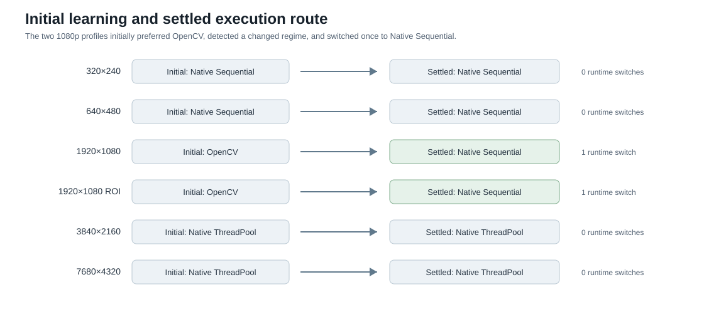

# SmartParallel v1.5 — Adaptive Execution Routes

SmartParallel v1.5 introduces an optional semantic-operation layer above the existing v1.4 scheduler. The first operation is exact 8-bit binary thresholding:

```cpp
#include <smart/vision/vision.hpp>

smart::vision::threshold(source, destination);
```

The application requests an operation, not a library or scheduler. Automatic mode learns among complete valid routes:

- Native SmartParallel sequential execution;
- Native SmartParallel ThreadPool execution;
- Native SmartParallel oneTBB execution when available;
- OpenCV `cv::threshold` when the optional provider is enabled.

StaticThread remains forceable for diagnostics but is not an automatic candidate in the first release. Native threshold routes use an authenticated runtime-selected AVX2, SSE2, or portable branchless scalar kernel before the existing scheduler divides work.

## Accepted release evidence

The final Windows/MSVC Release publication run contained **2,238 measured samples** and passed:

- exact correctness and route authentication with zero failures;
- all **6/6 route-selection gates**;
- all **6/6 native-kernel gates**;
- all **6/6 stable-dispatch gates**;
- all **6/6 combined release gates**.

On the recorded machine, Auto achieved a **1.16× geometric-mean speedup over the independent sequential loop** and **1.48× over direct OpenCV**. The two 1080p profiles initially learned OpenCV, detected a changed deployment regime, and switched once to Native Sequential before final measurement.



The route map and speedups are machine-specific. Auto should be used instead of copying these choices into hard-coded policy.

## Documents

- [API](api.md)
- [Architecture](architecture.md)
- [Benchmark results](benchmarks.md)
- [Benchmark methodology](benchmark-methodology.md)
- [Benchmark reproduction](benchmark-reproduction.md)
- [Validation](validation.md)
- [Known limitations](known-limitations.md)
- [Release notes](release-notes.md)
- [Accepted benchmark assets](assets/benchmarks/README.md)

v1.5 does not change the existing `parallel_for` or v1.4 algorithm APIs. The core installed target remains `SmartParallel::smart_parallel`; the optional semantic-operation module is exported separately as `SmartParallel::vision` through the `SmartParallelVision` package.
