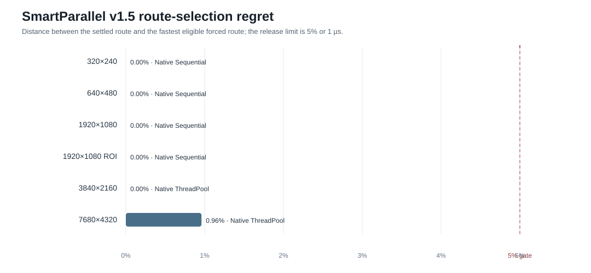
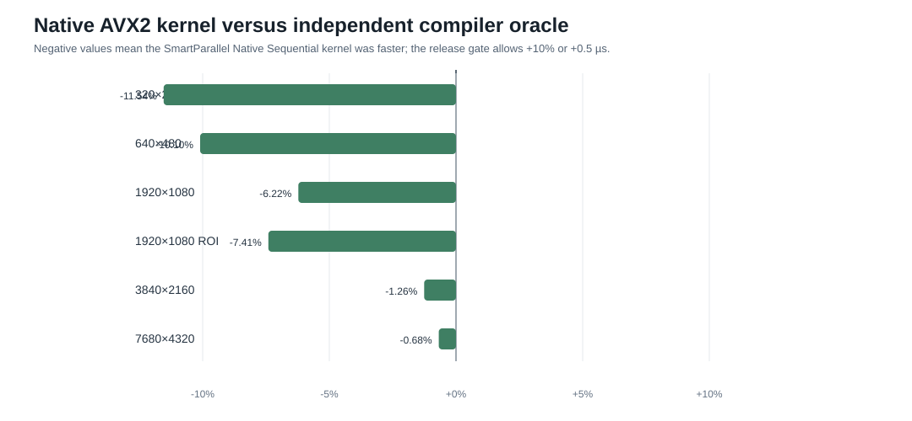
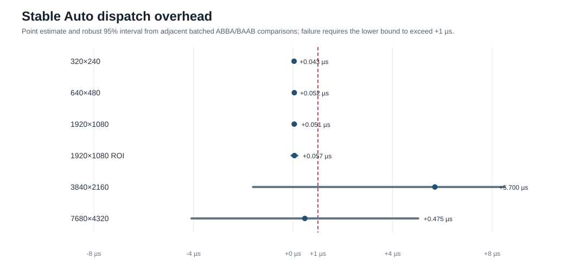

# v1.5 benchmark results

SmartParallel v1.5 was evaluated with the first semantic operation, exact one-channel `uint8_t` binary thresholding. The publication benchmark compared the same operation through:

- an independent compiler-generated sequential loop;
- direct OpenCV `cv::threshold`;
- SmartParallel Auto;
- forced Native Sequential, ThreadPool, StaticThread, and oneTBB routes;
- the forced SmartParallel OpenCV route.

The accepted publication run was produced on Windows/MSVC Release with 16 logical threads, a SmartParallel worker budget of 16, OpenCV 4.12.0, OpenCL disabled, and the authenticated Native AVX2 kernel. These are machine-specific measurements, not universal speed guarantees.

## Release verdict

The accepted run contains **2,238 measured samples**, with:

- **0 incorrect outputs**;
- **0 backend-authentication failures**;
- **6/6 route-selection gates passed**;
- **6/6 native-kernel gates passed**;
- **6/6 stable-dispatch gates passed**;
- **6/6 combined release gates passed**.

Across the six presets, SmartParallel Auto achieved a **1.16× geometric-mean speedup over the independent sequential loop** and a **1.48× geometric-mean speedup over the direct OpenCV API** on the recorded machine. The strongest gain against direct sequential execution was **1.85× at 3840×2160**. The 7680×4320 case was effectively tied with OpenCV, with Auto at 0.99× the direct OpenCV rate.

## Settled route map

| Workload | Settled Auto route | Auto median | Speedup vs direct sequential | Speedup vs direct OpenCV | Route-selection regret |
|---|---|---:|---:|---:|---:|
| 320×240 | Native Sequential | 2.6 µs | 1.00× | 1.81× | 0.00% |
| 640×480 | Native Sequential | 9.1 µs | 1.09× | 2.91× | 0.00% |
| 1920×1080 | Native Sequential | 91.2 µs | 1.08× | 1.49× | 0.00% |
| 1920×1080 ROI | Native Sequential | 109.7 µs | 0.98× | 1.31× | 0.00% |
| 3840×2160 | Native ThreadPool | 696.9 µs | 1.85× | 1.04× | 2.51% |
| 7680×4320 | Native ThreadPool | 4.362 ms | 1.15× | 0.99× | 0.61% |

Route-selection regret measures the settled route against the fastest eligible forced SmartParallel route under identical memory conditions. The release gate accepts routes within 5% or 1 µs because differences below that band are not operationally meaningful on this benchmark.

## Runtime adaptation

The two 1080p profiles initially learned OpenCV during repeated-call training. When the benchmark moved into a balanced interleaved deployment regime, OpenCV's relative cost changed. Sparse drift sentinels triggered a current-context comparison and SmartParallel switched both profiles once to Native Sequential before publication timing began.

This matters because the framework did not merely benchmark candidates once and trust the answer forever. It detected that its earlier decision had become stale and changed route using new observations.

## Native kernel quality

The Native Sequential route uses a runtime-selected AVX2, SSE2, or portable branchless kernel. The accepted machine authenticated AVX2. Native Sequential was within the release gate of an independent compiler-generated loop for every preset and was slightly faster in five of six cases.

The independent loop is intentionally separate from SmartParallel internals. It acts as a regression oracle: a change that slows the Native kernel cannot silently slow the benchmark reference at the same time.

## Stable decision overhead

For the four small and medium profiles, the estimated stable Auto lookup cost was approximately **0.012–0.051 µs**. At 4K and 8K, execution-runtime noise was wider than the decision cost; those cases passed as statistically inconclusive rather than claiming false precision.

The overhead measurement uses adjacent batched ABBA/BAAB comparisons between Auto and the equivalent forced route. The gate fails only when the lower robust 95% bound is above 1 µs.

## Interpretation

The result is not that Native SmartParallel always beats OpenCV. The result is that OpenCV is now a valid automatic specialist and SmartParallel can select it when it wins, reject it when a Native route is better, and revisit the decision when conditions change.

On another processor, OpenCV build, worker budget, image layout, or operation, the route map can be different. Applications should rely on Auto rather than copying this machine's choices into hard-coded policy.

## Evidence

- [Generated accepted results](assets/benchmarks/generated-results.md)
- [Machine-readable metrics](assets/benchmarks/benchmark-metrics.json)
- [Accepted six-preset summary](assets/benchmarks/accepted-summary.csv)
- [Accepted learning and adaptation telemetry](assets/benchmarks/accepted-learning.csv)
- [Accepted environment and OpenCV build information](assets/benchmarks/accepted-environment.txt)
- [Analyzer-generated publication report](assets/benchmarks/accepted-publication-report.md)
- [Source evidence hashes](assets/benchmarks/source-hashes.txt)
- [Full accepted publication evidence](assets/benchmarks/accepted-publication.zip) — raw CSV, learning telemetry, environment, build log, report, and figures.

See [benchmark methodology](benchmark-methodology.md) for the fairness and release-gate design, and [benchmark reproduction](benchmark-reproduction.md) for the one-line Windows workflow.
