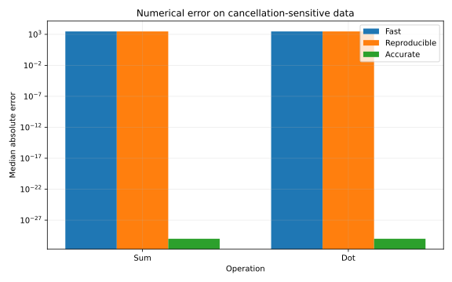
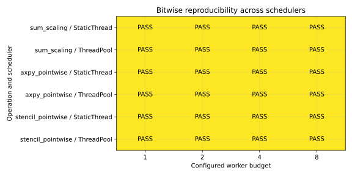
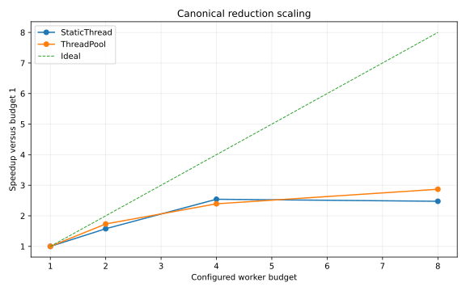
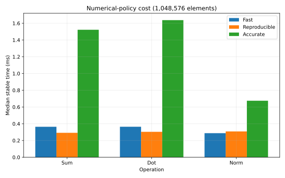
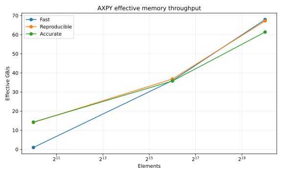
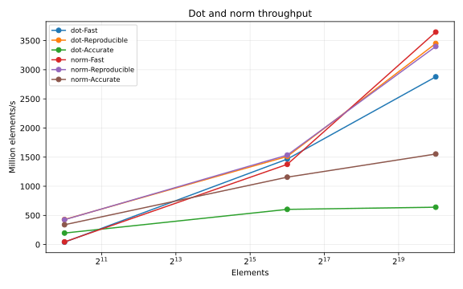
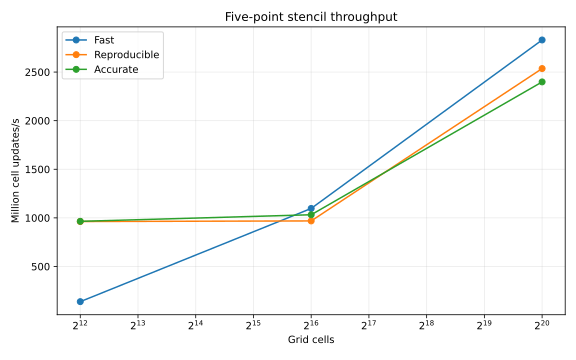
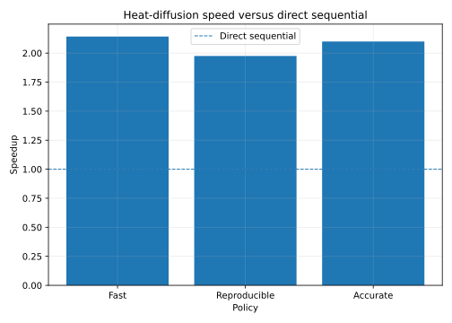
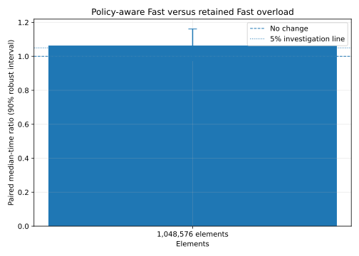

# SmartParallel v1.6 benchmark results

This page summarizes the accepted corrected schema-v2 publication. Raw data, generated statistics, metrics, environment information, source hashes, and SVG assets are retained under [`assets/benchmarks/`](assets/benchmarks/).

> All performance measurements are machine-specific. The accepted run used Linux, GCC 14.2, x86-64, and an Intel Xeon Platinum 8573C environment. The results establish release behavior on that environment, not universal performance.

## Release scorecard

| Gate | Result |
|---|---|
| Raw samples | **2,442** |
| Execution validity | **Pass** |
| Required reference accuracy | **Pass** |
| Reproducibility | **Pass** |
| Route authentication | **Pass** |
| Numerical capability | **Pass** |
| Sum cross-scheduler matrix | **Pass** |
| AXPY pointwise matrix | **Pass** |
| Stencil pointwise matrix | **Pass** |
| Pointwise plan authentication | **Pass** |
| Fast compatibility | **1.0634× paired median; 0.9739–1.1611× interval — Inconclusive-pass** |
| Scientific-kernel performance sanity | **Pass — all largest Fast workloads ≥0.5× direct sequential** |

## Numerical accuracy

The adversarial sum and dot inputs are intentionally cancellation-sensitive. Fast and Reproducible preserve their declared algorithms and expose an absolute error of 3000 on this dataset. Accurate uses compensated accumulation and reaches the independent reference exactly in the accepted run.

This is the key v1.6 result: the framework does not call every finite answer “correct.” It distinguishes valid execution from required reference accuracy and demonstrates the stronger algorithm where Accurate promises one.

## Reproducibility across schedulers

Reproducible and Accurate results were checked across available scheduler engines and worker budgets. Fixed reduction trees preserved scalar result bits, while fixed pointwise tiles preserved complete AXPY and stencil output digests.

## Policy costs

Accurate arithmetic can cost more because compensated or scaled states perform additional operations. Reproducible can be faster or slower than Fast depending on the operation, workload, scheduler, and machine; its objective is a fixed numerical plan, not a speed promise.

## Scientific operations

### AXPY

### Dot and norm

### Five-point stencil

The corrected pointwise architecture allows Reproducible and Accurate AXPY/stencil work to authenticate parallel execution instead of inheriting a reduction leaf size that accidentally serialized large grids.

## Heat-diffusion pilot

All three policies produced complete fields matching the independent reference and selected ThreadPool on the accepted workload. After the validated pointer/stride kernel correction, every policy outperformed the compact direct-sequential oracle on this machine:

| Route | Median for 20 iterations | Speed vs direct |
|---|---:|---:|
| Direct sequential | **4.948 ms** | 1.000× |
| SmartParallel Fast | 2.309 ms | **2.142×** |
| SmartParallel Reproducible | 2.505 ms | **1.975×** |
| SmartParallel Accurate | 2.356 ms | **2.100×** |

The correction did not weaken view safety: extents, strides, address spans, unique mappings, and overlap are still validated before execution. The hot loop then uses those validated pointers and strides rather than repeating checked indexing for every neighbor access. These timings are machine-specific.

## Fast compatibility

The accepted paired comparison does not establish a regression above the 5% investigation boundary. Its paired median is **1.0634×**, but the 90% robust interval is **0.9739–1.1611×**, so the result is classified **inconclusive-pass** rather than marketed as either a win or a slowdown:

## Evidence files

- [`accepted-raw.csv`](assets/benchmarks/accepted-raw.csv)
- [`accepted-summary.csv`](assets/benchmarks/accepted-summary.csv)
- [`benchmark-metrics.json`](assets/benchmarks/benchmark-metrics.json)
- [`accepted-publication-report.md`](assets/benchmarks/accepted-publication-report.md)
- [`accepted-validation-summary.md`](assets/benchmarks/accepted-validation-summary.md)
- [`accepted-environment.txt`](assets/benchmarks/accepted-environment.txt)
- [`source-hashes.txt`](assets/benchmarks/source-hashes.txt)

Two earlier Windows evidence sets remain historical traceability. A later final Windows/MSVC rerun was completed by the v1.7 release workflow after the validated pointer/stride kernels. It produced **3,936 samples**, passed every v1.6 correctness, numerical, reproducibility, route-authentication, pointwise-plan, Fast-compatibility, and scientific-kernel performance-sanity gate, and is retained under the [v1.7 Windows regression evidence](../v1.7/assets/benchmarks/windows-msvc-20260801/v1.6-regression/).
