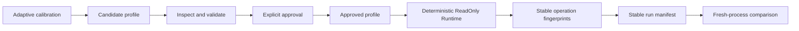

# SmartParallel v1.7.0 — Reproducible Runtime

**Trust goal:** **Trust the experiment.**

SmartParallel v1.7 turns the adaptive execution framework into an explicitly owned, inspectable, and reproducible runtime. It adds isolated `Runtime` instances, lightweight `ExecutionContext` handles, persistent profiles for named semantic operations, explicit Candidate/Approved trust states, exact Deterministic replay, stable execution fingerprints, and release tooling that proves the same approved experiment in fresh processes.

The v1.0–v1.6 free-function APIs, schedulers, nested coordination, v1.4 algorithms, v1.5 Vision routes, and v1.6 numerical contracts remain available.

## What v1.7 delivers

- Owned `RuntimeOptions`, `Runtime`, and copyable `ExecutionContext` types.
- Construction-time configuration isolation for explicit Runtime instances.
- `Adaptive` and `Deterministic` execution modes with separate contracts.
- `Disabled`, `ReadOnly`, and `ReadWrite` profile access policies.
- Persistent exact profiles for threshold, AXPY, dot, norm, and stencil 2D.
- Candidate evidence, explicit approval, and Approved-only deterministic replay.
- Canonical bounded JSON, duplicate-key rejection, SHA-256 integrity, and atomic explicit saving.
- Runtime, workload, operation, profile, and experiment fingerprints that exclude volatile process details.
- Installed calibration, profile inspection, approval, validation, comparison, and replay tools.
- A two-process heat-diffusion proof with byte-identical manifests and unchanged Approved evidence.
- Publication benchmarks for API overhead, cold/warm startup, Deterministic replay, profile scaling, calibration, compatibility rejection, and v1.6 regression protection.

## Quick start

```cpp
#include <smart/data/view.hpp>
#include <smart/linalg/operations.hpp>
#include <smart/runtime/runtime.hpp>

#include <vector>

int main()
{
    smart::RuntimeOptions options;
    options.worker_budget = 4;
    options.default_numerical_policy = smart::NumericalPolicy::Reproducible;

    smart::Runtime runtime(options);
    auto context = runtime.context();

    std::vector<double> x(4096, 2.0);
    std::vector<double> y(4096, 1.0);
    auto xv = smart::data::VectorView<const double>::contiguous(x.data(), {x.size()});
    auto yv = smart::data::VectorView<double>::contiguous(y.data(), {y.size()});

    smart::linalg::axpy(
        context,
        yv,
        0.5,
        xv,
        smart::NumericalOptions{smart::NumericalPolicy::Reproducible});

    const auto runtime_id = runtime.fingerprint().hash;
    const auto operation_id = runtime.last_operation_fingerprint().hash;
}
```

An `ExecutionContext` keeps the Runtime state alive and is cheap to copy. It carries configuration identity, nested-execution lineage, and any exact-plan override required by Deterministic replay; it does not duplicate a thread pool or profile database.

## Experiment lifecycle



The approval boundary is deliberate: calibration never silently promotes its own evidence, and Deterministic execution never falls back to Adaptive execution when exact replay cannot be authenticated.

## Accepted evidence at a glance

The final Windows/MSVC publication completed the full nine-stage release workflow:

- main Release regression: **24/24 passed**;
- isolated no-oneTBB/no-OpenCV regression: **24/24 passed**;
- oneTBB + OpenCV focused matrix: **3/3 passed**;
- exact returned source-ZIP matrix: **6/6 passed**;
- installed core, profile, Vision, and OpenCV consumers: **passed**;
- documentation and exact-ZIP documentation validation: **passed**;
- all v1.7 benchmark objectives: **accepted**;
- retained v1.6 correctness and performance-sanity gates: **passed**.

Adaptive warm start measured **2.600×** faster than a fresh cold Adaptive Runtime, with a deterministic-bootstrap 95% interval of **2.500–2.764×**. Deterministic replay measured **1.014×** warm Adaptive latency, with a **0.959–1.084×** interval.


Two fresh replay processes produced byte-identical manifests with SHA-256 `caa94172f51f4a161658ed39fff102340186ea6f3bba4f327a5a3fa2694e898c`, the same output digest, nine deterministic replays, and zero learning, timing, holdout, drift, route-switch, or profile-mutation activity.


All performance measurements are machine-specific. See the [complete benchmark report](benchmarks.md), [methodology](benchmark-methodology.md), and [validation matrix](validation.md).

## Documentation map

### Runtime and execution

- [Public API](api.md)
- [Architecture](architecture.md)
- [Runtime ownership and lifetime](runtime-ownership.md)
- [ExecutionContext](execution-context.md)
- [Backward-compatible default Runtime](default-runtime.md)
- [Adaptive and Deterministic modes](execution-modes.md)
- [Numerical policy versus execution mode](numerical-vs-execution.md)
- [Execution lineage](execution-lineage.md)

### Profiles, compatibility, and trust

- [Profile access policies](profile-access.md)
- [Profile schema](profile-schema.md)
- [Candidate and Approved states](candidate-approved.md)
- [Exact compatibility rules](compatibility.md)
- [Exact workload identity](workload-identity.md)
- [Adaptive warm start](warm-start.md)
- [Integrity model](integrity.md)
- [Atomic persistence](atomic-persistence.md)
- [Security and trust boundaries](security-and-trust.md)

### Evidence and tooling

- [Runtime and operation fingerprints](fingerprints.md)
- [Run manifests](run-manifests.md)
- [Offline calibration](calibration.md)
- [Profile tools](profile-tools.md)
- [Cross-process heat-diffusion proof](cross-process-heat-diffusion.md)
- [Benchmark results](benchmarks.md)
- [Benchmark methodology](benchmark-methodology.md)
- [Benchmark reproduction](benchmark-reproduction.md)
- [Release validation](validation.md)
- [Full release reproduction guide](reproduction-guide.md)

### Adoption and release

- [Migration from v1.6](migration.md)
- [Known limitations](limitations.md)
- [Release notes](release-notes.md)

## Scope boundary

v1.7 reproduces an approved execution identity only under exact compatible conditions. It does not promise cross-architecture or cross-compiler bitwise identity, global CPU governance across independent Runtime instances, safe concurrent multi-process profile writers, cryptographic authorship, or persistent identities for arbitrary callbacks. These boundaries are explicit so the release claim remains narrow, testable, and honest.
