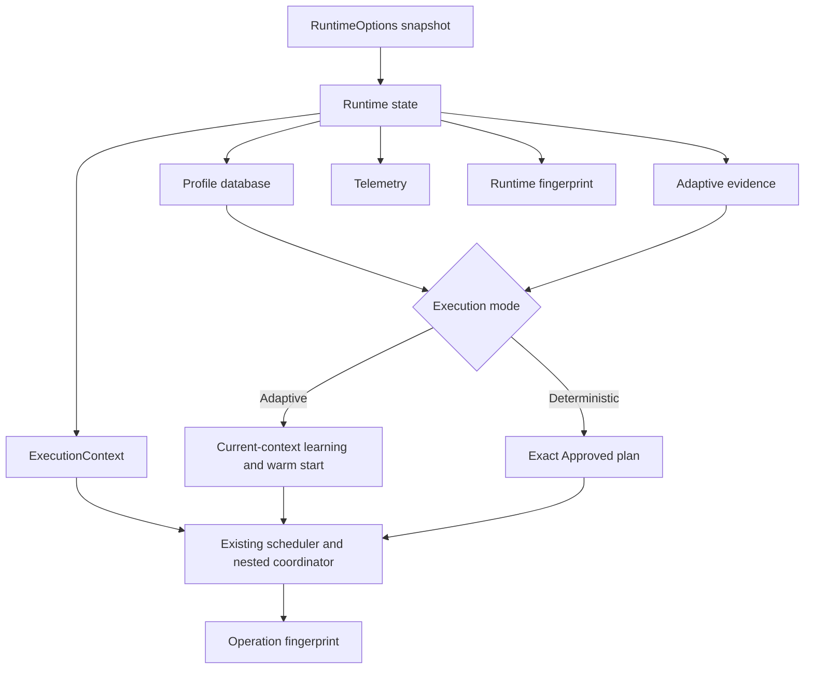

# SmartParallel v1.7 Reproducible Runtime architecture

v1.7 adds ownership and reproducibility around the existing SmartParallel scheduler; it does not introduce a second execution engine.

## Design goals

1. Isolate explicit Runtime configuration from later process-global changes.
2. Preserve the v1.0–v1.6 API and execution architecture.
3. Persist only named semantic operations with exact identities.
4. Separate adaptive evidence from approved deterministic evidence.
5. Keep profile I/O outside operation hot paths.
6. Make every replay decision inspectable through stable fingerprints and telemetry.

## Component model

A `Runtime` owns:

- an immutable `RuntimeOptions` snapshot;
- scheduler and provider capability identity;
- floating-point-environment and build identity;
- a synchronized in-memory profile database;
- adaptive evidence and telemetry;
- Runtime and last-operation fingerprint state.

`ExecutionContext` is the lightweight route into that state. It also carries the existing nested-execution lineage and any exact execution-plan override.

## Adaptive path

Adaptive execution may:

- use existing in-memory evidence;
- authenticate a compatible loaded Candidate or Approved profile as one restart warm start;
- collect timing, holdout, and drift evidence;
- replace a stale plan using current-context observations;
- update the in-memory Candidate database.

A loaded profile is evidence, not a permanent freeze. No operation automatically rewrites the profile file.

## Deterministic path

Deterministic execution requires an exact Approved semantic profile unless a generic callback uses an explicitly forced scheduler while profile access is Disabled. For profiled semantic operations, the Runtime validates the complete compatibility contract and then replays the saved route, scheduler, worker budget, numerical plan, and provider identity.

The exact-plan path bypasses:

- profiling and exploration;
- timing, holdout, and drift probes;
- route switching;
- warm-start logic;
- profile mutation;
- operation-time profile I/O.

If compatibility cannot be proven, execution fails before destination modification. There is no scheduler substitution and no fallback to Adaptive mode.

## Persistence boundary

Profiles are loaded only during Runtime construction or explicit `load_profiles`. Saving occurs only through explicit `save_profiles` or the command-line tools. The database is serialized canonically, validated, and atomically replaced. See [atomic persistence](atomic-persistence.md).

## Relationship to earlier releases

- v1.0/v1.1 scheduling and nested coordination remain the execution substrate.
- v1.4 algorithms retain their adaptive and direct-sequential paths.
- v1.5 complete Vision routes remain optional providers.
- v1.6 numerical policies and canonical plans remain the numerical contract.
- v1.7 records and replays the exact compatible execution identity around those existing components.
