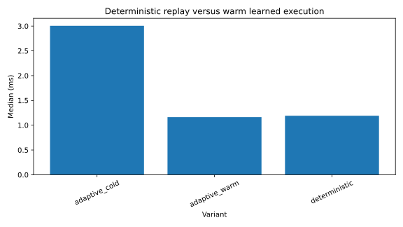
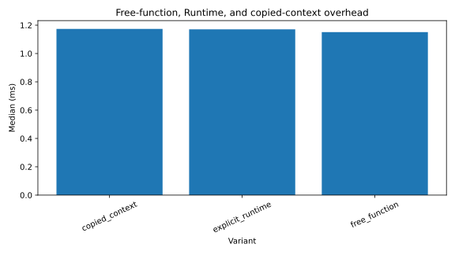
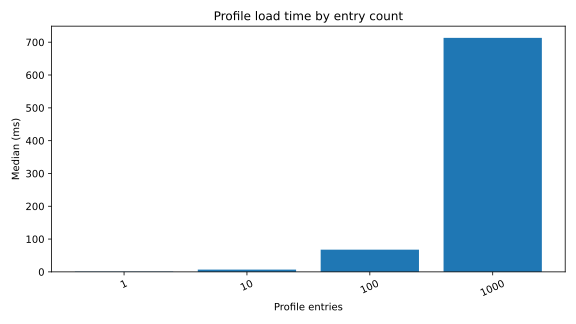
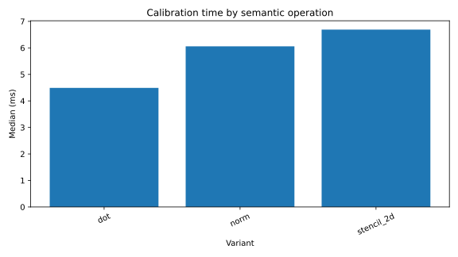
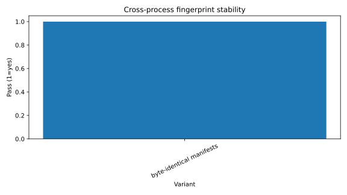
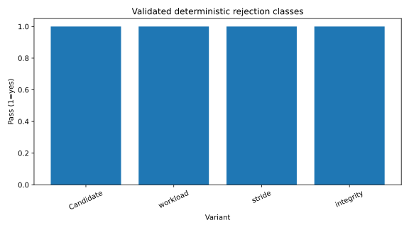
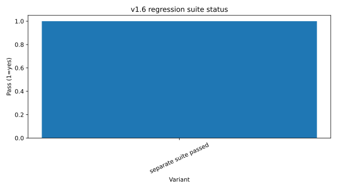

# SmartParallel v1.7 accepted benchmark evidence

v1.7 retains two accepted platform publications. The final Windows/MSVC run is the release-confirming nine-stage workflow; the Linux/GCC run provides an independent platform reference. Results are machine-specific and are not universal speed guarantees.

## Accepted platform records

| Platform record | Runtime repetitions | v1.7 status | Retained v1.6 status | Evidence |
|---|---:|---|---|---|
| Windows 11 / MSVC 19.44 / x86-64 / oneTBB | 31 | All objectives accepted | All gates passed, 3,936 samples | [`windows-msvc-20260801/`](assets/benchmarks/windows-msvc-20260801/README.md) |
| Linux / GCC / x86-64 | 31 | All objectives accepted | All gates passed | [`linux-gcc-20260801/`](assets/benchmarks/linux-gcc-20260801/README.md) |

## Windows/MSVC release scorecard

| Gate | Result |
|---|---|
| Main Release regression | **24/24 passed** |
| Native-only no-oneTBB/no-OpenCV regression | **24/24 passed** |
| oneTBB + OpenCV focused tests | **3/3 passed** |
| Exact returned source-ZIP tests | **6/6 passed** |
| Installed core/profile/Vision/OpenCV consumers | **Passed** |
| Installed calibration, approval, and fresh-process replay | **Passed** |
| Documentation and exact-ZIP documentation | **Passed** |
| v1.7 objective gates | **All accepted** |
| v1.6 numerical/correctness/reproducibility gates | **Passed** |
| Source ZIP SHA-256 | `aca096c061c99bf9344ae98d632e1906df6b78cd47a2570315daa6024369993d` |

## Startup: cold, warm, and Deterministic

Fresh Adaptive cold execution measured **3.0055 ms** median. Loading compatible Candidate evidence reduced the median to **1.1631 ms**, a **2.600×** warm-start speedup with a 95% interval of **2.500–2.764×**. Deterministic Approved replay measured **1.1908 ms** and **1.014×** warm latency, with a **0.959–1.084×** interval.

The point is not that Deterministic is always faster. The result shows that exact no-learning replay remained within the declared 25% latency envelope while preserving the approved identity.

## Runtime and context overhead

The free-function, explicit Runtime, and copied-context calls execute the same AXPY workload. Median paired overhead was **9.900 µs** for explicit Runtime and **-0.100 µs** for a copied context. Both confidence intervals crossed the ±20 µs objective, so both are honestly reported as `INCONCLUSIVE-PASS`, not marketed as proven wins or classified as regressions.

## Profile-load scaling

Exact profile databases containing 1, 10, 100, and 1,000 entries were parsed and validated during Runtime construction. The 1,000-entry database loaded in **713.304 ms**, with a **708.684–716.005 ms** interval, or approximately **0.713 ms per entry**.

This is construction-time evidence. Operations do not access profile files.

## Calibration cost

The benchmark records offline calibration work for dot, norm, and stencil 2D. These measurements describe evidence-production cost, not operation hot-path overhead.

## Cross-process replay stability

The installed CLI pilot calibrated a 64×64, eight-iteration heat-diffusion experiment, produced two Candidate entries, approved them explicitly, and launched two fresh Deterministic ReadOnly processes.

Both processes produced:

- manifest SHA-256 `caa94172f51f4a161658ed39fff102340186ea6f3bba4f327a5a3fa2694e898c`;
- output digest `b10ced4bee0617873433aff5e2ea369135e9b48163924eb1ff249aec6756d3d3`;
- profile database hash `28c7b7a94bcc4bb678225edff43193e60b535cf3c2d9e889251f79bff673e7c6`;
- nine deterministic replays;
- zero learning samples, timing probes, holdout probes, drift probes, route switches, warm starts, cold starts, and profile mutations.

The Approved profile remained byte-identical before and after both runs.

## Compatibility rejection

Deterministic replay must fail closed when exact compatibility cannot be proven. The validation covers schema, operation, semantic version, type, numerical contract, workload, environment, build identity, scheduler/provider availability, worker budget, approval state, expiry, and integrity mismatches.

## Warm-start behavior by operation

Warm-start evidence is tracked for named semantic operations rather than arbitrary callbacks. The suite authenticates loaded restart evidence independently for dot, norm, and stencil 2D.

## v1.6 regression guard

The retained Windows v1.6 matrix produced **3,936 samples**. Every execution-validity, required-reference, reproducibility, route-authentication, numerical-capability, adversarial-accuracy, cross-scheduler, and pointwise-plan gate passed.

Largest Fast workloads measured these machine-specific speedups over compact direct-sequential references:

| Operation | Speedup |
|---|---:|
| AXPY | **1.585×** |
| Dot | **1.196×** |
| Norm | **2.572×** |
| Stencil 2D | **1.436×** |
| 20-step heat diffusion | **1.943×** |

The paired Fast compatibility ratio was **0.9766×**, with a 90% robust interval of **0.9096–1.0486×**, and passed the retained rule.

The full retained v1.6 charts and metrics are under [`windows-msvc-20260801/v1.6-regression/`](assets/benchmarks/windows-msvc-20260801/v1.6-regression/).

## Linux/GCC reference publication

The independent Linux/GCC run also accepted every v1.7 objective:

- Adaptive warm-start speedup: **2.29×**, 95% interval **2.15–2.46×**;
- Deterministic/warm ratio: **0.963×**, interval **0.940–1.087×**;
- 1,000-entry profile load: **154.696 ms**, interval **153.897–155.395 ms**;
- explicit Runtime and copied-context overhead: `INCONCLUSIVE-PASS`;
- retained v1.6 gates: passed.

Its full evidence remains in [`linux-gcc-20260801/`](assets/benchmarks/linux-gcc-20260801/README.md). Differences between the Windows and Linux timings are expected and reinforce why performance claims remain platform-specific.

## Evidence files

### Windows/MSVC

- [`accepted-raw.csv`](assets/benchmarks/windows-msvc-20260801/accepted-raw.csv)
- [`accepted-summary.csv`](assets/benchmarks/windows-msvc-20260801/accepted-summary.csv)
- [`benchmark-metrics.json`](assets/benchmarks/windows-msvc-20260801/benchmark-metrics.json)
- [`accepted-publication-report.md`](assets/benchmarks/windows-msvc-20260801/accepted-publication-report.md)
- [`accepted-validation-summary.md`](assets/benchmarks/windows-msvc-20260801/accepted-validation-summary.md)
- [`cross-process/`](assets/benchmarks/windows-msvc-20260801/cross-process/)
- [`source-zip.sha256`](assets/benchmarks/windows-msvc-20260801/source-zip.sha256)

### Linux/GCC

- [`accepted-raw.csv`](assets/benchmarks/linux-gcc-20260801/accepted-raw.csv)
- [`accepted-summary.csv`](assets/benchmarks/linux-gcc-20260801/accepted-summary.csv)
- [`benchmark-metrics.json`](assets/benchmarks/linux-gcc-20260801/benchmark-metrics.json)
- [`accepted-publication-report.md`](assets/benchmarks/linux-gcc-20260801/accepted-publication-report.md)

See [benchmark methodology](benchmark-methodology.md) before interpreting any performance value.
