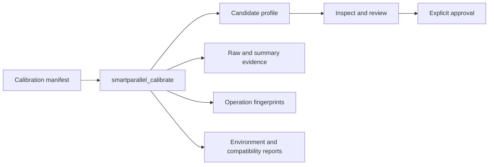

# SmartParallel v1.7 offline calibration

Offline calibration produces reviewable Candidate evidence for a named semantic operation. It never approves its own output.

## Build requirement

Configure with:

```text
-DSMARTPARALLEL_BUILD_V170_TOOLS=ON
```

The installed tool is `smartparallel_calibrate`.

## Workflow



Run calibration with:

```sh
smartparallel_calibrate calibration.json
```

## Manifest identity

The schema-v1 manifest identifies the experiment rather than relying on ambient defaults. It includes the semantic operation, exact dimensions, numerical policy, worker budget, repetitions, deterministic seed, and output directory. The heat-diffusion pilot additionally records iteration and boundary behavior.

## Generated evidence

A successful calibration emits:

- `candidate_profile.json`;
- raw and summary CSV evidence;
- metrics and environment JSON;
- compatibility report;
- operation fingerprints;
- SHA-256 evidence list;
- human-readable Markdown report.

The tool validates output correctness and route authentication before writing Candidate evidence.

## Candidate boundary

Candidate profiles may warm-start Adaptive execution. They are rejected by Deterministic mode. Promotion requires a separate `smartparallel_profile approve` command that revalidates integrity and evidence gates and writes a distinct Approved file.

## Accepted Windows pilot

The release CLI pilot calibrated a 64×64, eight-iteration Reproducible heat-diffusion experiment with worker budget 2. It produced two Candidate entries—stencil 2D and norm—with correctness passing. The Candidate database identity was `303e33def4ac337a49c686aa0a702b24f30a04aac1371ce87e85539f375d4f92`.

See [Candidate and Approved states](candidate-approved.md), [profile tools](profile-tools.md), and the [cross-process pilot](cross-process-heat-diffusion.md).
