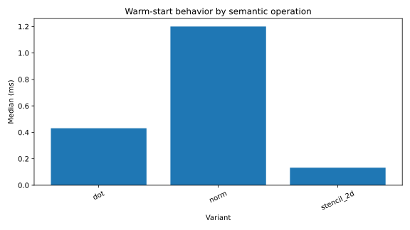

# SmartParallel v1.7 Adaptive warm start

A warm start is authenticated restart evidence loaded from storage, not merely a repeated call in the same Runtime.

## Definition

Only an entry loaded during Runtime construction or explicit `load_profiles` counts as restart warm-start evidence. Newly learned in-memory evidence does not masquerade as a process restart.

## Behavior

For a compatible named semantic operation:

1. The Runtime validates the loaded Candidate or Approved entry.
2. The first Adaptive call may use that entry as a warm-start plan.
3. The operation fingerprint records `warm_start: true`.
4. Later calls return to normal current-context adaptation.
5. Stale plans may be replaced by new in-memory Candidate evidence.

A loaded profile is therefore a starting point, not a permanent route lock.

## File behavior

- ReadOnly files remain byte-identical.
- ReadWrite permits explicit export of updated Candidate evidence.
- Operations never rewrite the file.
- Deterministic execution does not use warm-start semantics; it performs exact Approved replay.

## Accepted evidence

On the final Windows/MSVC publication, fresh Adaptive cold execution measured **3.0055 ms** median and loaded warm execution measured **1.1631 ms**, a **2.600×** speedup with a 95% interval of **2.500–2.764×**.

