# SmartParallel v1.8 — Accepted benchmark evidence

This page records the accepted Linux/GCC publication for the hardened v1.8 CPU-governance release. The evidence directory preserves the schema-v2 raw CSV, environment record, statistical metrics, human-readable report, fourteen SVG figures, and a plot manifest tying every figure to the raw-data SHA-256.

## Acceptance boundary

The portable release claims are correctness and resource-safety properties:

- governor-native participation remained at or below the declared budget;
- the ungoverned control produced real participating execution above effective CPU capacity;
- Adaptive admission retained distinct minimum, preferred, maximum, and granted worker fields;
- the oldest blocked exact request completed after no more than four bounded bypasses;
- nested execution did not expand the parent grant;
- deterministic insufficient-budget failure occurred before output modification;
- pending cancellation woke the queue directly;
- every raw benchmark record authenticated correctness.

All nine mandatory benchmark gates passed. Performance comparisons are machine-specific and are not converted into release correctness claims.

## Accepted Linux/GCC results

The publication used 31 repetitions, two untimed warmups per paired pressure condition, alternating governed/ungoverned order, and a paired bootstrap with 10,000 resamples at 95% confidence.

| Measurement | Accepted result |
|---|---:|
| Effective CPU capacity | 4 participants |
| Declared governor budget | 4 participants |
| Governed peak participation | 4 maximum |
| Ungoverned peak participation | 6 maximum |
| Uncontended acquire/release | 0.146248 µs [0.145617, 0.146789] |
| Oldest large-request completion rank | 5 in all 31 repetitions |
| Configured bounded bypass limit | 4 |
| Oldest large-request wait | median 224.134 µs; p95 306.366 µs |
| Governed/ungoverned throughput ratio | 0.771707 [0.677117, 0.850243] — **FAIL** |
| Governed/ungoverned p95-latency ratio | 1.29830 [1.17206, 1.44233] — **FAIL** |
| Governed/ungoverned completion-balance ratio | 1.69773 [1.46891, 1.73482] — **FAIL** |

The negative results mean this particular short CPU-pressure workload completed faster and with better completion balance when ungoverned. v1.8 does not hide that outcome. The demonstrated value in this publication is bounded participation, exact deterministic admission, nested safety, direct cancellation, starvation-resistant queue behavior, and explainability—not an unconditional speedup.

## Participation and real machine pressure

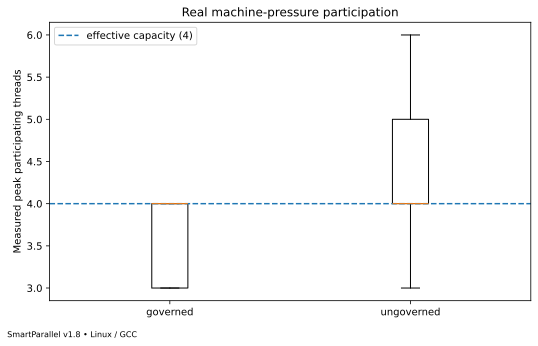

## Throughput and latency

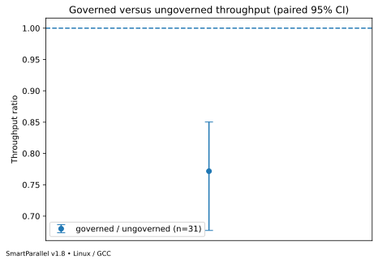

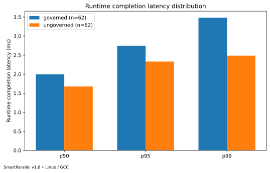

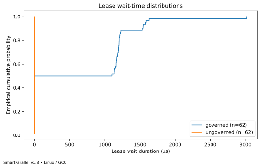

## Multi-Runtime admission and fairness

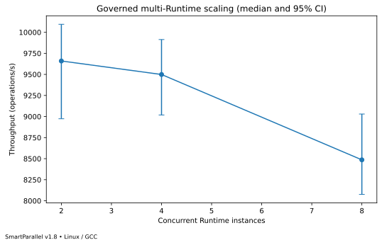

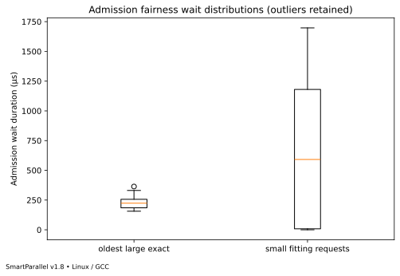

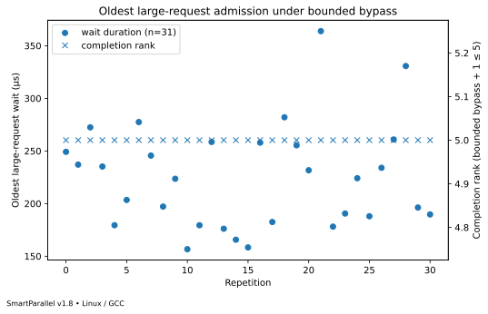

The fairness gate is deliberately separate from the governed-versus-ungoverned workload-completion balance metric. The queue gate proves bounded bypass and eventual admission; it does not promise equal application completion times.

## Admission overhead and partial grants

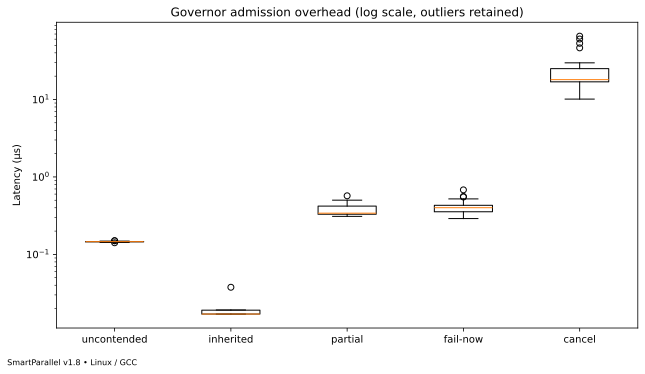

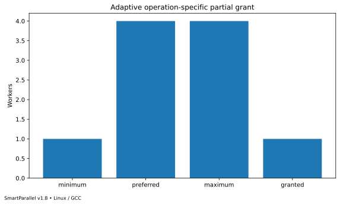

## Nested execution and schedulers

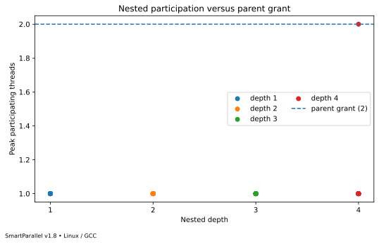

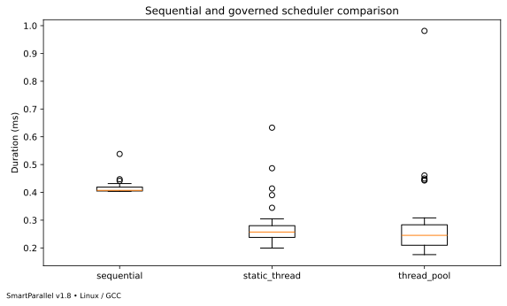

## Retained regression and deterministic admission

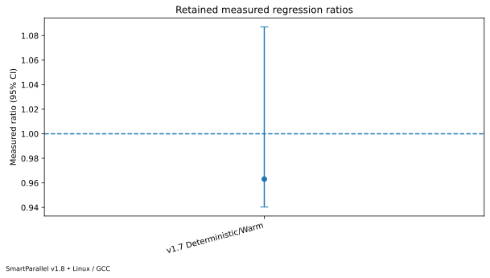

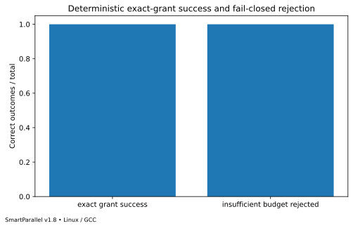

## Cross-platform publication state

The retained figures on this page are Linux/GCC results only. A cross-platform comparison figure is generated only when a second platform raw dataset is supplied to the analyzer. Windows/MSVC evidence must be produced and accepted separately before the release is tagged final; no placeholder Windows comparison is included.
